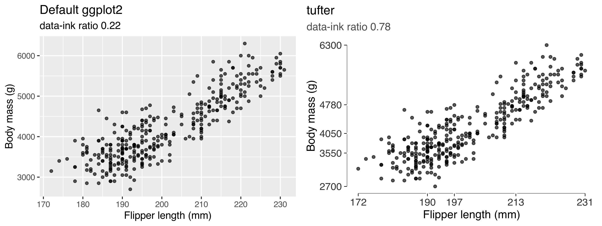
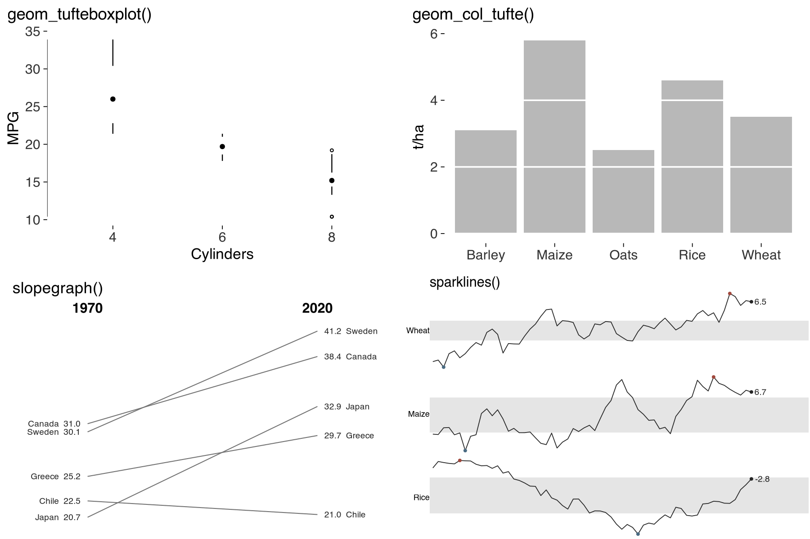

# tufter

<div class="package-kicker">R tools · Charles Crabtree</div>

<p class="package-lead">Make figures easier to read.</p>

I built `tufter` to help draw and review statistical graphics in R. It brings
Tufte-inspired plotting tools and measurements into `ggplot2`, so you can try a
change and examine what it does.

You can add a range frame, label a series directly, or compare two versions of
a figure's data-ink ratio. I use these as aids to judgement. A figure still
needs to answer a useful question, and no function here can decide that for you.



## Where to start

The [real-data guide](https://lobsterbush.github.io/tufter/articles/real-data.html)
works through examples using `gapminder` and `palmerpenguins`. For examples closer
to my research, try the
[simulated-data gallery](https://lobsterbush.github.io/tufter/articles/simulated-examples.html),
which includes survey experiments and callback rates.

There's also a [gallery using API data](https://lobsterbush.github.io/tufter/articles/live-data.html)
and a [measurement guide](https://lobsterbush.github.io/tufter/articles/measuring.html)
that explains how the estimates work and where they need care.

## Installation

You'll need R 4.1 or later and ggplot2 4.0.0 or later. I'm preparing the first
CRAN submission; for now, install from GitHub.

```r
# install.packages("remotes")
remotes::install_github("lobsterbush/tufter")
```

## Drawing figures

Choose the tools that help with your comparison. You don't need to use the
whole set.

| Function | What it does |
|---|---|
| `theme_tufte()` | Removes the panel background, grid, border and legend frame |
| `geom_rangeframe()` | Draws axis lines across the observed range |
| `geom_quartileframe()` | Marks the five-number summary along the axes |
| `geom_dotdash()` | Adds marginal ticks for individual observations |
| `geom_tufteboxplot()` | Shows a box plot using lines and median marks |
| `geom_col_tufte()` | Draws bars with gridlines as gaps through them |
| `geom_cleveland_dot()` | Compares values with dots and leader lines |
| `slopegraph()` | Compares two periods with values printed at each end |
| `sparkline()`, `sparklines()` | Shows time-series patterns in a small space |
| `facet_tufte()` | Uses fixed scales for comparisons across panels |
| `geom_text_last()` | Labels each series at its final point |
| `tufte_pal()`, `scale_colour_tufte()` | Supplies grey, accent, muted and divergent palettes |
| `label_source()` | Adds a source note to the figure |
| `save_tufte()` | Checks label space and saves at the requested print dimensions |

## Reviewing figures

These functions measure specific features. Their results are useful for
comparing drafts, but they don't provide an overall quality score.

| Function | What it checks or estimates |
|---|---|
| `data_ink_ratio()` | The share of ink from data layers, estimated from two renderings |
| `lie_factor()` | Proportional change shown relative to change in the data, for supported comparisons |
| `data_density()` | Estimated data entries per square inch |
| `bank_to_45()` | A panel height that brings line slopes closer to 45 degrees |
| `check_contrast()`, `contrast_ratio()` | Colour contrast against the background |
| `check_labels_fit()` | Space for titles, axes, legends and facet strips at the export size |
| `tufte_audit()` | Available checks and measurements for one figure |
| `audit_figures()` | Results across a set of figures, including skipped checks |



## A quick example

<!-- readme-short:start -->
```r
library(ggplot2)
library(tufter)
library(palmerpenguins)

peng <- penguins[complete.cases(penguins), ]
base <- ggplot(peng, aes(flipper_length_mm, body_mass_g)) + geom_point()

data_ink_ratio(base)
#> ── Data-ink ratio
#> 34% of the ink in this figure varies with the data.
#> • data ink: 18613 pixel-equivalents
#> • non-data ink: 36472
#> • measured at 6.5in x 4in, 150 dpi

lean <- base + geom_rangeframe() + theme_tufte()

data_ink_ratio(lean)
#> ── Data-ink ratio
#> 87% of the ink in this figure varies with the data.
#> • data ink: 24298 pixel-equivalents
#> • non-data ink: 3579
#> • measured at 6.5in x 4in, 150 dpi
```
<!-- readme-short:end -->

## Running an audit

<!-- readme-audit:start -->
```r
tufte_audit(base)
#> ── Tufte audit ──
#> At 6.5in x 4in: 3 stated criteria not met.
#> ── Not met
#> ✖ The panel uses a #EBEBEBFF background fill. Try removing it and compare
#>   whether the figure is easier to read.
#> Erase non-data ink - VDQI ch. 4
#> ✖ Minor gridlines are drawn. Consider whether readers need this level of detail
#>   to estimate values.
#> Erase non-data ink - VDQI ch. 4
#> ✖ No caption is present. Add the data source with label_source() so readers can
#>   check where the numbers came from.
#> Documentation - Beautiful Evidence ch. 6
#> ── Measured, not graded
#> Tufte states a direction for these rather than a threshold. Read them against
#> another draft of the same figure.
#> • Data-ink ratio 0.34: an estimated 34% of the ink comes from data layers.
#>   Compare drafts at the same dimensions; there's no target value.
#> • Data density 32.9 entries per square inch: 666 estimated entries over 20.2
#>   square inches. Read this alongside the figure and entry count.
#> • 1 distinct colour in use. This is a count, not a verdict on whether the
#>   colours help readers.
#> • One series in one panel. There's no series grouping to separate into small
#>   multiples.
#> ── Met
#> • No full panel border
#> • No pie chart
#> • Lie factor within Tufte's band
#> • No legend to decode
#> • No variable encoded twice
#> • Wider than it is tall
#> • Ink clears the WCAG contrast minimum
#> • Measured labels fit at the printed size
```
<!-- readme-audit:end -->

I've kept criteria with explicit rules separate from measurements without a
numerical target. The audit checks, for example, whether bars start at zero.
It reports data-ink ratio and density without grading them. Tufte asks that
these increase, but doesn't specify how much is enough.

`tufte_principles()` records that distinction in its `criterion` column.
`audit_figures()` lets you review a whole set of plots, starting with those
that have the most unmet criteria. Check its `skipped` column too: a check
that couldn't run may leave a problem undetected.

## What it won't tell you

The package can't assess whether a figure supports a causal claim or makes a
useful substantive comparison. You can see those limits in the principles
table.

```r
p <- tufte_principles()
p[!p$audited, c("principle", "implemented_by")]
#> Show comparisons            slopegraph(), facet_tufte()
#> Show causality              NA
#> Show multivariate data      facet_tufte(), sparklines()
#> Content counts most of all  NA
```

There are limits to the measurements too. Label fitting doesn't check text
inside panels. Contrast checks don't resolve every overlap or filled label
background. I'd always inspect the exported figure at the size and in the
setting where it'll be read.

## Other packages you might use

[`ggthemes`](https://github.com/jrnold/ggthemes) includes its own `theme_tufte()`,
`geom_rangeframe()` and `geom_tufteboxplot()`. Loading both packages can mask
those names; use `tufter::` or `ggthemes::` to be explicit.

For more flexible label placement, see
[`directlabels`](https://cran.r-project.org/package=directlabels) and
[`ggrepel`](https://cran.r-project.org/package=ggrepel). The direct-label tools
here handle series endpoints and don't move overlapping labels apart.
[`GGenemy`](https://cran.r-project.org/package=GGenemy) provides additional
accessibility checks, including colour-vision deficiency tools.

I built `tufter` because I wanted to work with these measurements alongside
the plotting tools. I don't treat a higher data-ink ratio as a goal in itself.
The [measurement guide](https://lobsterbush.github.io/tufter/articles/measuring.html#and-a-larger-caveat-the-principle-itself-is-contested)
discusses the evidence and the limits of that principle.

## Provenance

| Declaration | Mark and standard |
| :--- | :--- |
| AI – Human (editor) | 🤖✏️👤 · [The Latent Review provenance standard](https://thelatentreview.com/provenance/) |

I'm the human editor and maintainer. Anthropic's Claude, through Claude Code,
wrote most of the original R source, tests, documentation and vignettes.
OpenAI's Codex assisted with the audit, fixes and site redesign, including this
rewrite. I specified the design and retain editorial responsibility.

I've recorded the completed checks and remaining CRAN requirements in
[cran-comments.md](https://github.com/lobsterbush/tufter/blob/main/cran-comments.md).
If you find a problem, please
[open an issue](https://github.com/lobsterbush/tufter/issues).

## Development and replication

From the repository root, install the development tools and dependencies, then
regenerate the help files and run the checks.

```r
install.packages(c("devtools", "pkgdown", "here"))
devtools::install_deps(dependencies = TRUE)
devtools::document()
devtools::test()
devtools::check(args = "--as-cran")
```

Run `Rscript data-raw/build_site.R` to rebuild the site. The API-data article
uses a saved snapshot; refreshing it is a separate manual step.
`Rscript data-raw/make_readme_figures.R` regenerates the README illustrations,
and `Rscript data-raw/make_readme_output.R` updates its example output.

## Sources

- Tufte, E. R. (2001). *The Visual Display of Quantitative Information*, 2nd ed.
- Tufte, E. R. (1990). *Envisioning Information*.
- Tufte, E. R. (1997). *Visual Explanations*.
- Tufte, E. R. (2006). *Beautiful Evidence*.

## Author

I'm Charles Crabtree, Senior Lecturer in the School of Social Sciences at
Monash University and K-Club Professor at University College, Korea University.

The package is available under the MIT licence.
