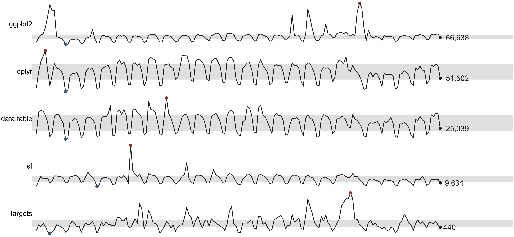
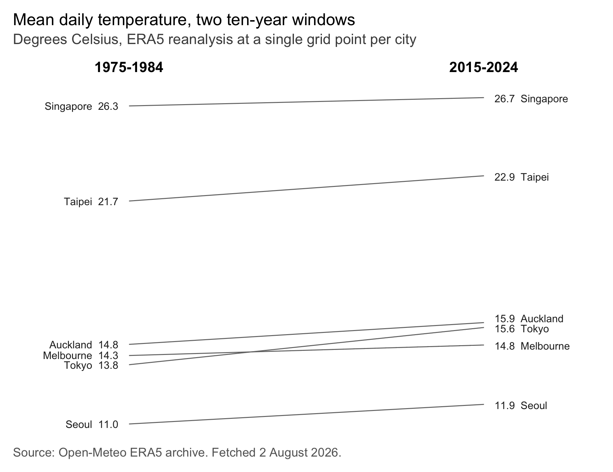
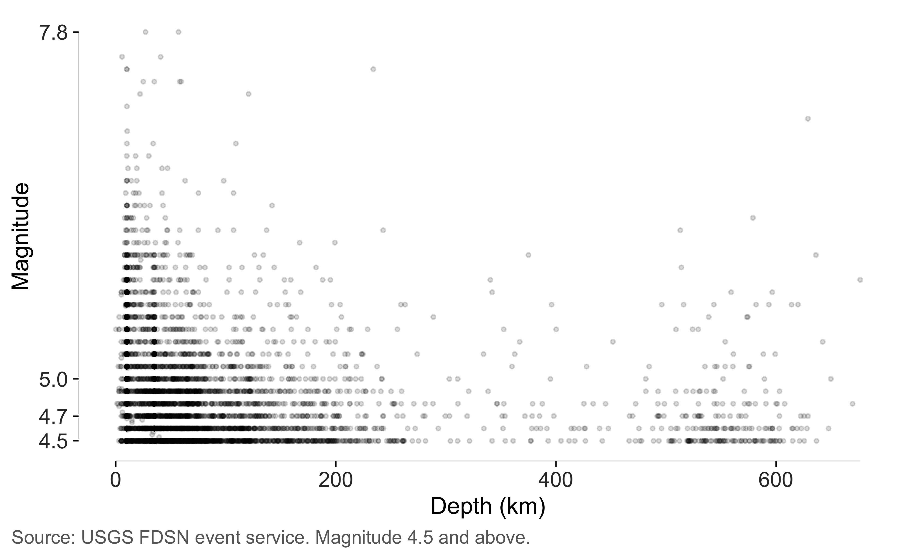
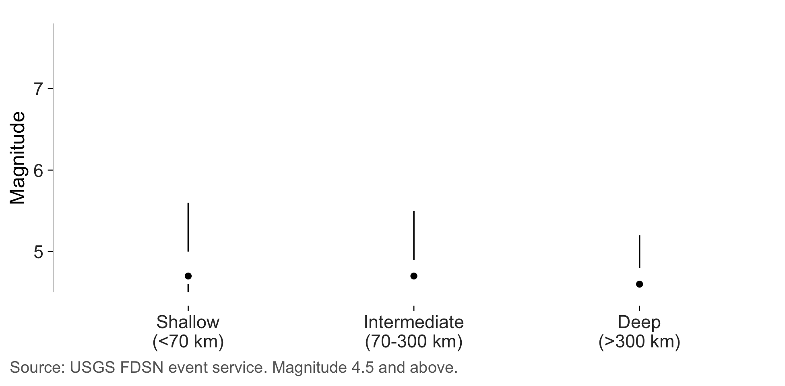
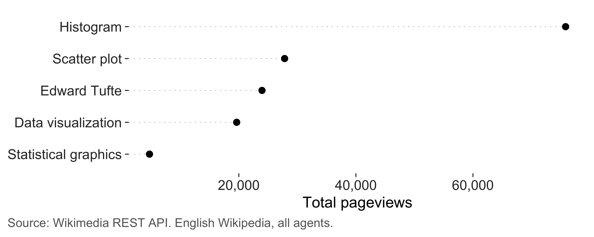
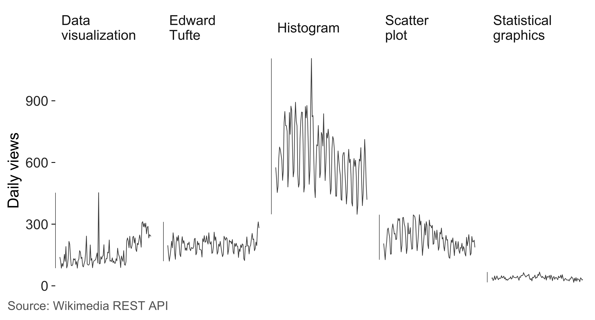

# Examples with live API data

The [other
gallery](https://lobsterbush.github.io/tufter/articles/simulated-examples.md)
uses simulated data, which is handy because you can regenerate it
anywhere. This one uses real numbers from four public APIs, none of
which need a key or a login:

| Source | What it gives | Endpoint |
|----|----|----|
| CRAN download logs | daily downloads per package | `cranlogs.r-pkg.org` |
| USGS FDSN event service | every earthquake above a magnitude | `earthquake.usgs.gov` |
| Open-Meteo ERA5 archive | daily temperature anywhere, back to 1940 | `archive-api.open-meteo.com` |
| Wikimedia REST API | daily pageviews per article | `wikimedia.org` |

I picked these because real data misbehaves in ways simulated data
doesn’t, and the measurements in this package are more interesting when
they’re pointed at something messy.

## How the fetching works

The article reads a cached snapshot rather than calling the APIs while
the page builds. Four API calls on every documentation build would be
slow, impolite to whoever runs them, and would break the build on the
day one of them is down. The fetching lives in
[`data-raw/fetch_live_examples.R`](https://github.com/lobsterbush/tufter/blob/main/data-raw/fetch_live_examples.R),
which you can run yourself to refresh everything.

Here’s the shape of it. Each call is one URL and one
[`fromJSON()`](https://jeroen.r-universe.dev/jsonlite/reference/fromJSON.html),
with no authentication anywhere.

``` r
library(jsonlite)

# Daily downloads for one package, last 180 days.
fromJSON(sprintf(
  "https://cranlogs.r-pkg.org/downloads/daily/%s:%s/ggplot2",
  Sys.Date() - 182, Sys.Date() - 2
))$downloads[[1]]

# Every earthquake at magnitude 4.5 or above in the last year.
fromJSON(paste0(
  "https://earthquake.usgs.gov/fdsnws/event/1/query?format=geojson",
  "&starttime=", Sys.Date() - 365, "&endtime=", Sys.Date(),
  "&minmagnitude=4.5&orderby=time"
))

# Daily mean temperature at a point, for a decade.
fromJSON(paste0(
  "https://archive-api.open-meteo.com/v1/archive?latitude=35.68&longitude=139.69",
  "&start_date=2015-01-01&end_date=2024-12-31",
  "&daily=temperature_2m_mean&timezone=UTC"
))$daily

# Daily pageviews for one Wikipedia article.
fromJSON(paste0(
  "https://wikimedia.org/api/rest_v1/metrics/pageviews/per-article",
  "/en.wikipedia/all-access/all-agents/Edward_Tufte/daily/20260401/20260731"
))$items
```

The snapshot ships with the package, so everything below runs offline.

``` r
live <- readRDS("../../data-raw/live-examples.rds")

format(live$fetched_at, "%d %B %Y")
#> [1] "02 August 2026"
vapply(live[c("cran", "quakes", "climate", "pageviews")], nrow, integer(1))
#>      cran    quakes   climate pageviews 
#>       905      7909        12       605
```

## Sparklines: CRAN downloads

Five packages, daily downloads, six months each. Sparklines are the
right form here because each series has its own scale and I only want
the shape. `targets` gets a few hundred downloads a day and `ggplot2`
gets tens of thousands, so plotting them on shared axes would flatten
four of the five into a line along the bottom.

The grey band is the interquartile range, the blue and red dots are the
minimum and maximum, and the number at the right is the last value.
`accuracy = 1` rounds those to whole downloads, since a tenth of a
download would be an odd thing to print.

``` r
sparklines(live$cran, day, downloads, package, accuracy = 1)
```



The spike in `ggplot2` is real. It hits 264,504 downloads in a day
against a median of 74,340, which is the kind of thing you notice in a
sparkline and would miss in a table. I don’t know what caused it. A
release, a mirror re-syncing, or a large CI fleet would all look like
this from the outside.

## Banking: how tall should that panel be?

Take one of those series on its own. The shape you see depends on how
tall you draw it, and
[`bank_to_45()`](https://lobsterbush.github.io/tufter/reference/bank_to_45.md)
picks the height that puts the median slope nearest 45 degrees, where
Cleveland found we judge slope most accurately.

``` r
gg <- subset(live$cran, package == "ggplot2")

series <- ggplot(gg, aes(day, downloads)) +
  geom_line(linewidth = 0.3) +
  geom_rangeframe(sides = "l") +
  labs(x = NULL, y = "Daily downloads") +
  theme_tufte()

bank_to_45(series, width = 6.5)
#> 
#> ── Banking to 45 degrees
#> Aspect ratio 0.148 (height / width), from 180 segments by "median_slope".
#> At 6.5in wide, that's a panel 0.96in tall. Allow more for axis labels and
#> titles.
```

That height is for the panel. A saved figure needs room on top of it for
the axis labels and the y title, and at the banked height exactly the y
title runs off the top.
[`check_labels_fit()`](https://lobsterbush.github.io/tufter/reference/check_labels_fit.md)
measures that.

``` r
check_labels_fit(series, width = 6.5, height = 1.3)
#> Warning in check_labels_fit(series, width = 6.5, height = 1.3): 1 element will be clipped at 6.5in x 1.3in.
#> ✖ y axis title needs 1.26in but has 0.92in.
#> ℹ Hard-wrap the text, widen the canvas, or reduce the font size.
#> # A tibble: 5 × 4
#>   element                      required_in available_in fits 
#>   <chr>                              <dbl>        <dbl> <lgl>
#> 1 layout (non-panel width)           0.864         6.5  TRUE 
#> 2 layout (non-panel height)          0.38          1.3  TRUE 
#> 3 y axis title                       1.26          0.92 FALSE
#> 4 x axis labels (side by side)       0.417         5.64 TRUE 
#> 5 y axis labels (stacked)            0.222         0.92 TRUE
```

So give it a little more room. The panel stays close to banked and the
title fits.

``` r
series
```


The weekly cycle is the obvious feature once the panel is short.
Downloads fall at weekends, which you can see as a regular beat rather
than having to be told. The three tall spikes and the early plateau stay
visible, which is the point of banking: the routine variation reads as
slope instead of as a solid band, so the unusual days stand out against
it.

## Slopegraphs: two decades of temperature

Six cities around the Pacific, mean daily temperature averaged over 1975
to 1984 and again over 2015 to 2024. Every number gets printed on the
graphic, so the y axis is redundant and goes.

``` r
slopegraph(live$climate, period, mean_temp, city, accuracy = 0.1) +
  labs(
    title = "Mean daily temperature, two ten-year windows",
    subtitle = "Degrees Celsius, ERA5 reanalysis at a single grid point per city"
  ) +
  label_source("Open-Meteo ERA5 archive", note = "Fetched 2 August 2026.")
```



All six rise, by between 0.4 and 1.8 degrees. I want to be careful about
what that does and doesn’t show. These are single grid points from a
reanalysis product, so a city with a lot of building between the two
windows picks up its own heat island along with everything else, and two
decades isn’t long enough to separate the two. It’s a real comparison of
two real averages, and it isn’t a climate attribution.

What the slopegraph does well here is the ordering and the one place it
changes. Singapore is the warmest and moved least, at 0.4 degrees. Tokyo
started second-coolest of the six and moved most, and it’s the only line
that crosses another: it begins below Melbourne and ends above it. That
crossing is the sort of thing a slopegraph is for, and the sort of thing
a pair of bar charts would bury.

## Distributions: earthquakes

7,909 earthquakes at magnitude 4.5 or above in the last year, with
magnitude against depth. A quartile frame breaks the axis at the
five-number summary, so the frame reports the distribution instead of
boxing the panel.

``` r
q <- live$quakes
```

I’ve used one on magnitude and a plain range frame on depth, and the
reason is worth spelling out. Depth is badly skewed: the median is 18 km
against a maximum of 676, so four of its five quartile marks pile up in
the first tenth of the axis and the labels sit on top of each other. The
crowding is real information, since it’s telling you the distribution is
skewed, and it also makes for an axis nobody can read. On a variable
like that I’d rather use a range frame and let the points show the skew.

``` r
ggplot(q, aes(depth_km, magnitude)) +
  geom_point(alpha = 0.15, size = 0.7) +
  geom_quartileframe(sides = "l") +
  geom_rangeframe(sides = "b") +
  scale_y_continuous(breaks = quartile_breaks(q$magnitude)) +
  labs(x = "Depth (km)", y = "Magnitude") +
  theme_tufte() +
  label_source("USGS FDSN event service", note = "Magnitude 4.5 and above.")
```



Magnitude is skewed too, and there the frame handles it well. The breaks
sit at 4.5, 4.7, 5, 7.8, so three quarters of the events fall in the
bottom sixth of the axis and the long empty stretch above 5 is the whole
story about how rare big earthquakes are.

Split by the standard depth classes and the minimal box plot does the
comparison.

``` r
q$zone <- cut(
  q$depth_km, c(-Inf, 70, 300, Inf),
  labels = c("Shallow\n(<70 km)", "Intermediate\n(70-300 km)", "Deep\n(>300 km)")
)

ggplot(q, aes(zone, magnitude)) +
  geom_tufteboxplot(outliers = FALSE) +
  geom_rangeframe(sides = "l") +
  labs(x = NULL, y = "Magnitude") +
  theme_tufte() +
  label_source("USGS FDSN event service", note = "Magnitude 4.5 and above.")
```



Two things about that figure.

The three distributions are nearly identical. Deep events are much
rarer, 289 against 6,272 shallow ones, and their median magnitude is 4.6
against 4.7 for shallow. A tenth of a magnitude unit in a catalogue
censored at 4.5 is not worth much.

The outlying points are off. Earthquake magnitudes follow roughly an
exponential distribution, so the usual rule of 1.5 times the
interquartile range flags between four and eleven percent of events
depending on the class. Those are the ordinary tail rather than
anomalies, and drawing three hundred of them buries the summary the box
plot exists to show. The scatterplot above shows every one.

The lower whiskers are worth reading carefully too. They stop at 4.5
because that’s what I asked the API for, so they’re an artefact of the
query rather than of the earth. That belongs on the figure rather than
in a reader’s head, which is what the note in
[`label_source()`](https://lobsterbush.github.io/tufter/reference/label_source.md)
is doing.

## Dot plots: Wikipedia pageviews

Five articles, total views over four months. A dot plot suits this
better than bars, because zero is a long way below the smallest value
and starting there would waste most of the panel. A dot encodes its
value by position, so it reads honestly on a scale that excludes zero.

``` r
totals <- aggregate(views ~ article, live$pageviews, sum)

ggplot(totals, aes(views, stats::reorder(article, views))) +
  geom_cleveland_dot() +
  scale_x_continuous(labels = scales::label_comma()) +
  labs(x = "Total pageviews", y = NULL) +
  theme_tufte() +
  label_source("Wikimedia REST API", note = "English Wikipedia, all agents.")
```



Histogram beats the other four put together, which I didn’t expect and
which I think says more about homework than about interest in graphical
design.

Sort before you plot. An alphabetical dot plot throws away the main
advantage of the form, which is that you can read rank straight off it.

## Small multiples

The same five series again, this time at a fixed scale so the levels are
comparable. That’s what small multiples are for, and it’s the opposite
choice from the sparklines at the top of this page.

``` r
ggplot(live$pageviews, aes(date, views)) +
  geom_line(linewidth = 0.25, colour = "grey30") +
  geom_rangeframe(sides = "l") +
  facet_tufte(~ article, ncol = 5) +
  scale_y_continuous(labels = scales::label_comma()) +
  labs(x = NULL, y = "Daily views") +
  theme_tufte() +
  theme(axis.text.x = element_blank(), axis.ticks.x = element_blank()) +
  label_source("Wikimedia REST API")
```



At a fixed scale you can see that four of the five are quiet and one
isn’t. The sparklines told you the shape of each series and hid that
comparison; this tells you the comparison and hides most of the shape.
Both are honest and they answer different questions.

## Auditing a real figure

Everything above can be measured. Here’s the earthquake figure, audited
at the size I’d print it.

``` r
quake_figure <- ggplot(q, aes(depth_km, magnitude)) +
  geom_point(alpha = 0.15, size = 0.7) +
  geom_quartileframe() +
  labs(x = "Depth (km)", y = "Magnitude") +
  theme_tufte() +
  label_source("USGS FDSN event service")

tufte_audit(quake_figure, width = 6.5, height = 4)
#> 
#> ── Tufte audit ──
#> 
#> At 6.5in x 4in: 1 stated criterion not met.
#> 
#> ── Not met
#> ✖ data mark #D8D8D8 sits at contrast 1.4 against the background, below the
#>   published minimum of 3.0. This isn't one of Tufte's criteria. It's the limit
#>   past which erasing ink stops being economy and starts being an unreadable
#>   figure.
#> Legibility - WCAG 2.1, not Tufte
#> 
#> ── Measured, not graded
#> Tufte states a direction for these rather than a threshold. Read them against
#> another draft of the same figure.
#> • Data-ink ratio 0.81: 81% of the ink varies with the data. Tufte asks that
#>   this be maximised within reason and names no threshold, so read it against
#>   another draft of this figure rather than against a target.
#> • Data density 824.7 numbers per square inch: 15818 entries over 19.2 square
#>   inches. Tufte ranks published graphics by this and sets no minimum.
#> • 1 distinct colour in use. Tufte's advice on colour is qualitative, so this is
#>   a count and not a verdict.
#> • One series in one panel, so there is nothing to separate into small
#>   multiples.
#> 
#> ── Met
#> • Panel carries no background fill
#> • No minor gridlines
#> • No full panel border
#> • No pie chart
#> • Lie factor within Tufte's band
#> • No legend to decode
#> • No variable encoded twice
#> • The figure names its source
#> • Wider than it is tall
#> • Nothing is clipped at the printed size
```

Both measurements are worth a look. The data density comes out at 825
numbers per square inch, against about three for the mtcars scatterplot
in the [measuring
article](https://lobsterbush.github.io/tufter/articles/measuring.md).
7,909 events over 2 mapped variables will do that, and comparing figures
against each other is exactly what Tufte uses this quantity for. He
never sets a minimum.

The data-ink ratio comes out at 0.81, far above anything else in these
docs, which makes sense once you look at what’s on the page. Eight
thousand marks is a lot of ink, and the frame it sits inside is three
hairlines and some text. If anything the true figure is higher still,
because overlapping points get counted once and this plot has a great
many piled up near the origin. The measuring article works through that
bias.

Both numbers are written into the sentence by inline R code, so
refreshing the data refreshes the prose with it.

## Contrast, on a figure drawn faintly on purpose

Those points are drawn at 15 percent opacity, which is the right call
for overplotting and a bad one for anyone reading the figure on a
projector.
[`check_contrast()`](https://lobsterbush.github.io/tufter/reference/check_contrast.md)
composites the transparency first, so it measures what the reader
actually sees.

``` r
check_contrast(quake_figure)
#> # A tibble: 4 × 5
#>   role      colour  ratio threshold passes
#>   <chr>     <chr>   <dbl>     <dbl> <lgl> 
#> 1 data mark #D8D8D8  1.43       3   FALSE 
#> 2 caption   grey40   5.74       4.5 TRUE  
#> 3 axis text grey20  12.6        4.5 TRUE  
#> 4 data mark black   21          3   TRUE
```

Black at 15 percent opacity composites to `#D8D8D8`, which comes out at
1.4 against white and sits well below the minimum of 3. In a scatterplot
I think that’s a defensible trade, since the shape of the cloud carries
the message and no individual point matters. I’d still rather know than
not. If this were going on a slide I’d raise the alpha and shrink the
points instead.

## Refreshing the data

``` r
Rscript data-raw/fetch_live_examples.R
```

That rewrites `data-raw/live-examples.rds`, and this page picks up the
new numbers on the next build. Every value quoted in the prose is inline
R code, so it moves with the data.
