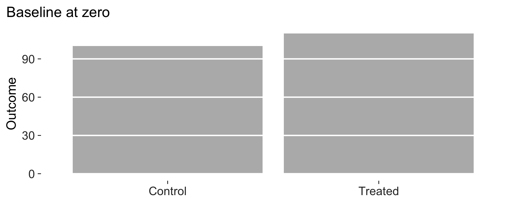
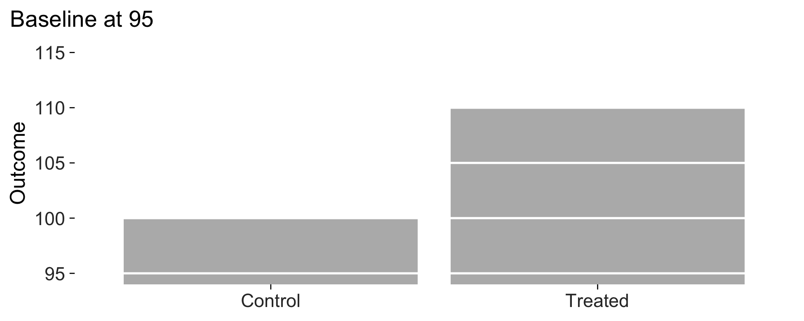

# Measuring a figure

Most of what people take from Tufte is a look. The more interesting
claim in *The Visual Display of Quantitative Information* is
methodological: that statistical graphics can be evaluated, and that he
can give you the quantities to do it with. This article works through
what each of those quantities means here, how it is computed, and where
it will lead you astray if you quote it without thinking.

All data below are simulated.

``` r
set.seed(20260729)
n <- 400
d <- data.frame(
  x = rnorm(n, 50, 12),
  g = sample(c("Treated", "Control"), n, replace = TRUE)
)
d$y <- 12 + 0.42 * d$x + ifelse(d$g == "Treated", 3.1, 0) + rnorm(n, 0, 5)
```

## The data-ink ratio

Tufte defines the data-ink ratio as the share of a graphic’s ink devoted
to the non-redundant display of data, and asks that it be pushed towards
one. That is a definition, not a procedure: no book tells you how to
count ink on a screen.

[`data_ink_ratio()`](https://lobsterbush.github.io/tufter/reference/data_ink_ratio.md)
estimates it empirically. The plot is rendered to a bitmap twice, once
whole and once with every data layer stripped out of the panel grobs.
Each pixel contributes in proportion to how far it sits from the
background colour, so an anti-aliased edge counts as the fraction of a
pixel it actually is. What is left after subtraction is data ink.

``` r
base <- ggplot(d, aes(x, y)) +
  geom_point(size = 1, alpha = 0.5) +
  labs(x = "Pre-treatment score", y = "Outcome")

data_ink_ratio(base)
#> 
#> ── Data-ink ratio
#> 19% of the ink in this figure varies with the data.
#> • data ink: 8567 pixel-equivalents
#> • non-data ink: 36866
#> • measured at 6.5in x 4in, 150 dpi
```

Almost nothing. The grey panel alone is most of that ink, and it does
not change when the data change.

``` r
lean <- base + geom_rangeframe() + theme_tufte()
data_ink_ratio(lean)
#> 
#> ── Data-ink ratio
#> 74% of the ink in this figure varies with the data.
#> • data ink: 9911 pixel-equivalents
#> • non-data ink: 3412
#> • measured at 6.5in x 4in, 150 dpi
```

The same numbers, drawn with about seven times the share of the ink
doing work.

### Where it misleads

Three things are worth knowing before you quote the number.

**Overlap is counted once.** A dense scatterplot draws many points on
top of each other, and the measurement sees one blob. So dense plots
understate their own data-ink, which is the opposite of the direction
you would want the bias to run.

``` r
dense <- data.frame(x = rnorm(20000), y = rnorm(20000))
sparse <- dense[1:60, ]

lean_theme <- list(geom_rangeframe(), theme_tufte())

c(
  dense = data_ink_ratio(
    ggplot(dense, aes(x, y)) + geom_point(size = 0.4, alpha = 0.2) + lean_theme
  )$ratio,
  sparse = data_ink_ratio(
    ggplot(sparse, aes(x, y)) + geom_point(size = 0.4) + lean_theme
  )$ratio
)
#>     dense    sparse 
#> 0.9758607 0.4125326
```

**Redundant data-ink still counts as data-ink.** Tufte would subtract
ink that repeats information the reader already has. No measurement can
tell whether a mark is repeating something, so this estimate does not
try.

**The number depends on the size you render at.** Non-data ink is
largely fixed furniture, so shrinking the canvas raises the ratio.
Compare figures at the size you intend to print them, and compare like
with like.

``` r
vapply(
  c(3, 6.5, 12),
  function(w) data_ink_ratio(lean, width = w, height = w * 0.6)$ratio,
  numeric(1)
)
#> [1] 0.7215738 0.7440596 0.7103622
```

Treat it as a comparative instrument. It is reliable for judging whether
one version of a figure is leaner than another, and unreliable as an
absolute score.

### And a larger caveat: the principle itself is contested

The three problems above are measurement error. There is a fourth
problem, which is that maximising the data-ink ratio is not
straightforwardly good, and the experimental evidence has said so for
thirty years.

Gillan and Richman (Human Factors, 1994) found that higher data-ink did
make readers faster and more accurate, but concluded that the principle
as stated is too simple: non-data ink is not one thing. An axis helps; a
decorative background does not; and which is which depends on the task
and the graph type. Inbar, Tractinsky and Meyer (2007) found that
readers preferred graphs that were *not* minimalist, accepting moderate
reduction and rejecting Tufte’s version of it. Bateman and colleagues,
in “Useful Junk?” (CHI 2010), found that embellished charts were
recalled better over the long run than plain ones. More recently the
accessibility argument has been pressed hard: a hairline on a white
background at low contrast is lean and also unreadable for a good number
of people.

I have not resolved any of that, and this package does not try to. The
design consequence is that the numbers here are meant as *descriptive
diagnostics*, not as an objective function. “This figure spends
ninety-five percent of its ink on furniture” is a useful thing to know.
“Therefore push the ratio to one” does not follow, and if you take it to
the limit you will produce figures that are elegant, economical, and
worse to read. The audit reports; you decide.

This is also why
[`theme_tufte()`](https://lobsterbush.github.io/tufter/reference/theme_tufte.md)
takes a `grid` argument rather than refusing to draw one. A faint grid
is the honest choice whenever readers have to recover values rather than
compare shapes.

## The lie factor

The lie factor is the size of the effect shown in the graphic divided by
the size of the effect in the data. A truthful graphic has a lie factor
of one, and Tufte treats anything outside roughly 0.95 to 1.05 as
distortion.

Given the numbers directly, it reproduces his own examples. The
fuel-economy graphic in *The Visual Display* showed an eighteen percent
change as a line growing by seven hundred and eighty-three percent.

``` r
lie_factor(c(18.0, 27.5), c(0.6, 5.3))
#> [1] 14.84211
```

Given a plot, it computes the distortion introduced by a baseline that
is not zero, which is by far the most common way a real published figure
lies. A bar’s length stops being the quantity it stands for.

``` r
means <- data.frame(
  condition = c("Control", "Treated"),
  outcome = c(100, 110)
)

honest <- ggplot(means, aes(condition, outcome)) +
  geom_col_tufte(fill = "grey72") +
  labs(x = NULL, y = "Outcome") +
  theme_tufte()

truncated <- honest + coord_cartesian(ylim = c(95, 115))

c(honest = lie_factor(honest), truncated = lie_factor(truncated))
#>    honest truncated 
#>   1.00000  16.66667
```

A ten percent difference drawn as a sixteen-fold one. Here they are side
by side; the second is the figure that gets published.

``` r
print(honest + labs(title = "Baseline at zero"))
```



``` r
print(truncated + labs(title = "Baseline at 95"))
```



### Where it misleads

The plot method only looks at bars. A truncated axis on a line chart or
a dot plot is not necessarily a lie, because those marks encode position
rather than length, and Tufte’s own advice is that they may be cropped
freely. So
[`lie_factor()`](https://lobsterbush.github.io/tufter/reference/lie_factor.md)
returns `1` for a scatterplot regardless of its limits. That is correct
behaviour and easy to misread as a clean bill of health.

## Data density

The number of entries in the data matrix divided by the area of the data
graphic, in square inches. Tufte’s complaint about most published
statistical graphics is that they are enormous and say almost nothing: a
chart carrying four numbers over half a page would have been better as a
sentence.

``` r
data_density(lean, width = 6.5, height = 4)
#> 
#> ── Data density
#> 79.4 numbers per square inch of data graphic.
#> • 800 rows x 2 mapped variables = 1600 entries
#> • over 20.14 square inches
```

The entries are counted as rows drawn times distinct variables mapped to
aesthetics, and the area is the panel rather than the whole figure,
since that is what Tufte means by “the data graphic”. Constants set
outside [`aes()`](https://ggplot2.tidyverse.org/reference/aes.html) do
not count, because they carry no data.

``` r
four_numbers <- data.frame(g = letters[1:4], v = c(3, 7, 5, 9))
data_density(
  ggplot(four_numbers, aes(g, v)) + geom_col_tufte() + theme_tufte(),
  width = 6.5, height = 4
)
#> 
#> ── Data density
#> 0.4 numbers per square inch of data graphic.
#> • 4 rows x 2 mapped variables = 8 entries
#> • over 20 square inches
```

Sixteen numbers per square inch sounds respectable until you notice the
whole figure carries eight of them. The density measure rewards a plot
for having many mapped variables even when those variables are the same
column twice, so read it alongside the redundant-encoding check in the
audit.

## Checking that nothing is clipped

Not a Tufte quantity, but the failure that ruins more figures than any
of them. `ggplot2` does not wrap long text: it clips it at the device
edge, silently, and a subtitle that fits on screen at the default device
size is not a subtitle that fits in the saved file.

[`check_labels_fit()`](https://lobsterbush.github.io/tufter/reference/check_labels_fit.md)
renders at the size you intend to print and measures every text element
against the space available.

``` r
wordy <- lean + labs(
  subtitle = paste(rep("A subtitle that runs on rather too long", 4),
                   collapse = " ")
)

check_labels_fit(wordy, width = 6.5, height = 4)
#> Warning in check_labels_fit(wordy, width = 6.5, height = 4): 1 element will be clipped at 6.5in x 4in.
#> ✖ subtitle needs 10.18in but has 6.50in.
#> ℹ Hard-wrap the text, widen the canvas, or reduce the font size.
#> # A tibble: 7 × 4
#>   element                      required_in available_in fits 
#>   <chr>                              <dbl>        <dbl> <lgl>
#> 1 layout (non-panel width)           0.609         6.5  TRUE 
#> 2 layout (non-panel height)          0.809         4    TRUE 
#> 3 subtitle                          10.2           6.5  FALSE
#> 4 x axis title                       1.49          6.5  TRUE 
#> 5 y axis title                       0.125         6.5  TRUE 
#> 6 x axis labels (side by side)       0.667         5.89 TRUE 
#> 7 y axis labels (stacked)            0.556         3.19 TRUE
```

It also catches axis labels that cannot sit side by side, which is the
other common failure and the one that is hardest to see in a preview
pane.

``` r
long_labels <- data.frame(
  condition = c("Non-post-conflict baseline", "Post-conflict, high intensity",
                "Post-conflict, low intensity"),
  value = c(3.1, 4.8, 4.0)
)

check_labels_fit(
  ggplot(long_labels, aes(condition, value)) + geom_col_tufte() + theme_tufte(),
  width = 4, height = 3
)
#> Warning in check_labels_fit(ggplot(long_labels, aes(condition, value)) + : 1 element will be clipped at 4in x 3in.
#> ✖ x axis labels (side by side) needs 5.08in but has 3.47in.
#> ℹ Hard-wrap the text, widen the canvas, or reduce the font size.
#> # A tibble: 6 × 4
#>   element                      required_in available_in fits 
#>   <chr>                              <dbl>        <dbl> <lgl>
#> 1 layout (non-panel width)           0.526         4    TRUE 
#> 2 layout (non-panel height)          0.581         3    TRUE 
#> 3 x axis title                       0.694         4    TRUE 
#> 4 y axis title                       0.125         4    TRUE 
#> 5 x axis labels (side by side)       5.08          3.47 FALSE
#> 6 y axis labels (stacked)            0.667         2.42 TRUE
```

[`save_tufte()`](https://lobsterbush.github.io/tufter/reference/save_tufte.md)
runs this check before it writes the file, so the warning arrives while
you can still act on it.

## Putting it together

[`tufte_audit()`](https://lobsterbush.github.io/tufter/reference/tufte_audit.md)
runs all of the above plus the structural checks, and scores them.

``` r
bad <- ggplot(d, aes(g, y, fill = g)) +
  geom_col(stat = "summary", fun = "mean")

suppressWarnings(tufte_audit(bad, width = 6.5, height = 4))
#> 
#> ── Tufte audit ──
#> 
#> 8/15 checks passed (53%), at 6.5in x 4in.
#> 
#> ── Failing
#> ✖ The panel is filled with #EBEBEBFF. A tinted panel is ink that never varies
#>   with the data.
#> Erase non-data ink (VDQI ch. 4)
#> ✖ Minor gridlines are drawn. They divide space the reader is not reading to
#>   that precision.
#> Erase redundant data-ink (VDQI ch. 4)
#> ✖ A legend with 2 entries makes the reader look away, hold a colour in memory,
#>   and look back. With this few series, label them on the plot with
#>   geom_text_last().
#> Integrate word and image (Beautiful Evidence ch. 5)
#> ✖ 'g' is mapped to both position and colour. The second encoding adds ink and a
#>   legend without adding information.
#> Erase redundant data-ink (VDQI ch. 4)
#> ✖ No caption. A graphic should name its source on the graphic, so the claim can
#>   be checked without hunting through the text. See label_source().
#> Documentation (Beautiful Evidence ch. 6)
#> ✖ data mark #00BFC4 at contrast 1.9 against the background, below the 3.0
#>   minimum. Maximising data-ink is not a licence to draw in colours people
#>   cannot see.
#> Legibility (WCAG 2.1, against VDQI ch. 4)
#> ✖ Data density is 0.2 numbers per square inch: 4 entries over 17.1 square
#>   inches. A graphic this empty would be shorter as a sentence.
#> Maximise data density (VDQI ch. 8)
#> 
#> ── Worth a look
#> ℹ No frame at all. That is defensible, but geom_rangeframe() would give the
#>   axis something to say.
#> 
#> ── Passing
#> • No pie chart
#> • Bars start at zero
#> • Lie factor near one
#> • Colour stays a code
#> • Comparison by repetition
#> • The figure tends toward the horizontal
#> • Most ink varies with the data
#> • Nothing is clipped at the printed size
```

Six separate problems, named: the tinted panel, the minor gridlines, a
legend that should have been a direct label, the grouping variable
encoded twice, no source note, and four numbers spread over seventeen
square inches. The same data, drawn properly:

``` r
good <- ggplot(d, aes(g, y)) +
  geom_tufteboxplot() +
  geom_rangeframe(sides = "l") +
  labs(x = NULL, y = "Outcome") +
  theme_tufte() +
  label_source("Simulated data, n = 400")

tufte_audit(good, width = 6.5, height = 4)
#> 
#> ── Tufte audit ──
#> 
#> 14/15 checks passed (93%), at 6.5in x 4in.
#> 
#> ── Failing
#> ✖ Data-ink ratio is 0.29: 29% of the ink in this figure varies with the data.
#> Maximise the data-ink ratio (VDQI ch. 4)
#> 
#> ── Passing
#> • Panel background carries no data
#> • Grid is no heavier than the data
#> • Frame reports the data range
#> • No pie chart
#> • Lie factor near one
#> • No legend to decode
#> • Colour stays a code
#> • No variable encoded twice
#> • Comparison by repetition
#> • The figure says where its numbers came from
#> • The figure tends toward the horizontal
#> • Ink is dark enough to see
#> • The figure earns its space
#> • Nothing is clipped at the printed size
```

## Every figure in the paper at once

Auditing one plot is useful while you are drawing it. Auditing all of
them, the evening before you submit, is when it earns its keep, because
the figure with the truncated subtitle is never the one you were looking
at.

``` r
figures <- list(
  scatter = good,
  bars = bad,
  faint = ggplot(d, aes(x, y)) +
    geom_point(colour = "grey85") + theme_tufte() + label_source("Simulated")
)

suppressWarnings(audit_figures(figures, measure = FALSE))
#> 
#> ── Tufte audit: 3 figures ──
#> 
#> ── Needing work, worst first
#> bars (50%, 6 failing)
#> Panel background carries no data, Grid is no heavier than the data, No legend
#> to decode, No variable encoded twice, The figure says where its numbers came
#> from, Ink is dark enough to see
#> faint (91%, 1 failing)
#> Ink is dark enough to see
#> 
#> ── Passing every check
#> • scatter
#> 
#> ℹ Full detail for any one figure: `attr(x, "audits")[["<name>"]]`
```

It also takes a directory, so a replication package whose figures were
saved with [`saveRDS()`](https://rdrr.io/r/base/readRDS.html) can be
checked in one call.

## What the score is not

The score is the share of applicable checks passed, and it is a prompt
rather than a verdict. A figure can pass every check and still be
pointless, because Tufte’s first principle is that content counts most
of all, and no function evaluates that.

[`tufte_principles()`](https://lobsterbush.github.io/tufter/reference/tufte_principles.md)
is the honest inventory. Its `audited` column marks which principles a
function can verify and which it cannot, and the ones it cannot are
listed anyway.

``` r
p <- tufte_principles()
p[!p$audited, c("principle", "source", "implemented_by")]
#> # A tibble: 9 × 3
#>   principle                  source                        implemented_by       
#>   <chr>                      <chr>                         <chr>                
#> 1 The dot-dash plot          VDQI ch. 6                    geom_dotdash()       
#> 2 Shrink the graphic         VDQI ch. 8                    sparkline(), sparkli…
#> 3 Position beats length      VDQI ch. 5                    geom_cleveland_dot() 
#> 4 Micro and macro readings   Envisioning Information ch. 2 sparklines(), facet_…
#> 5 Show comparisons           Beautiful Evidence ch. 6      slopegraph(), facet_…
#> 6 Show causality             Beautiful Evidence ch. 6      annotation, not code 
#> 7 Show multivariate data     Beautiful Evidence ch. 6      facet_tufte(), spark…
#> 8 Sparklines                 Beautiful Evidence ch. 2      sparkline(), sparkli…
#> 9 Content counts most of all Beautiful Evidence ch. 6      you
```

Showing comparisons, showing causality, showing multivariate data, and
content counting most of all are not things a package can check. They
are what the figure is for. What the audit is good for is the mechanical
failures underneath them: the ones that are real, that are common, and
that authors stop seeing after the fifth draft.
