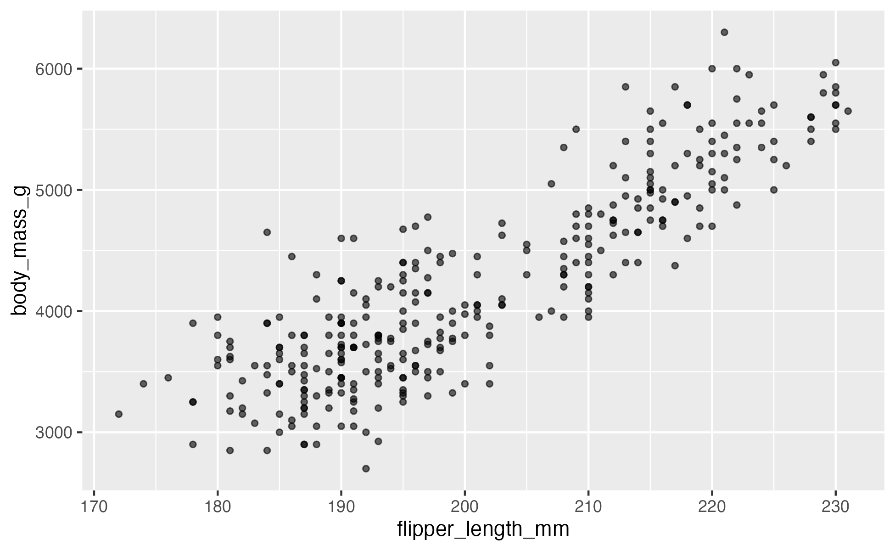
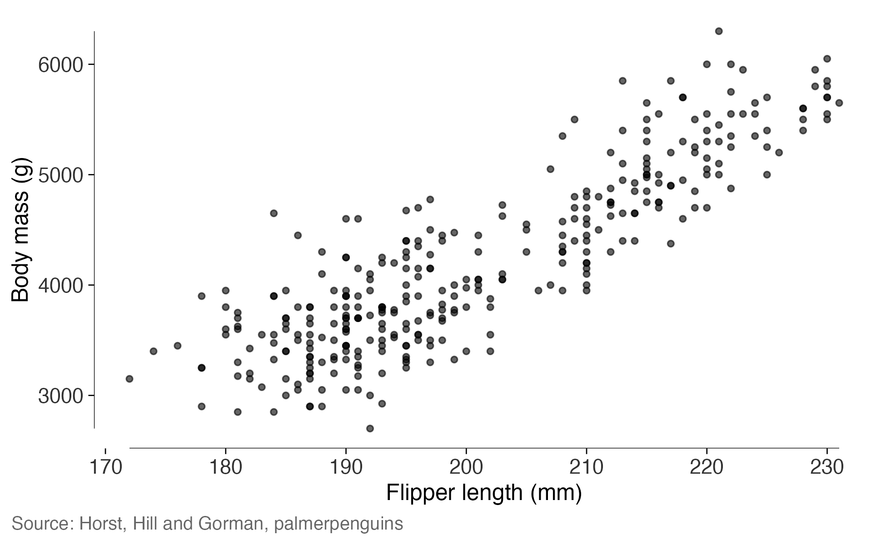
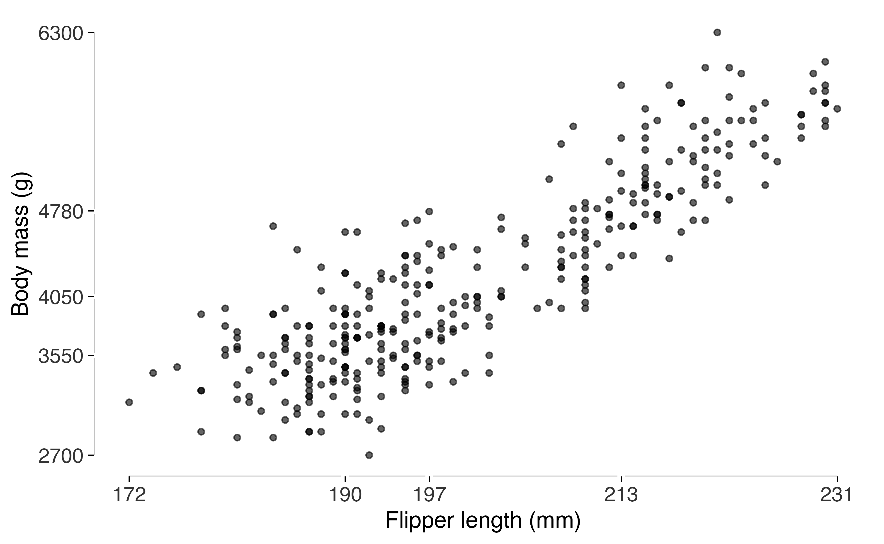
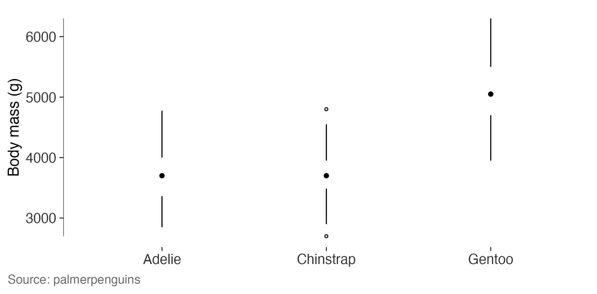
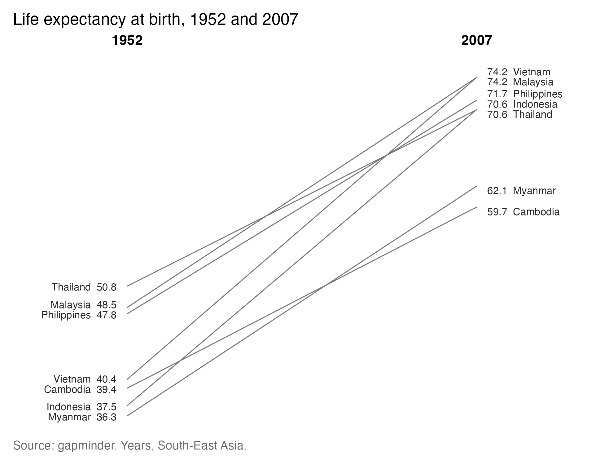
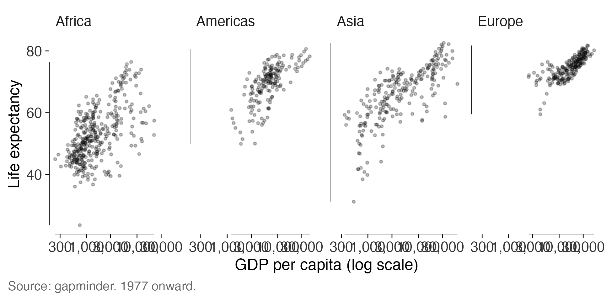
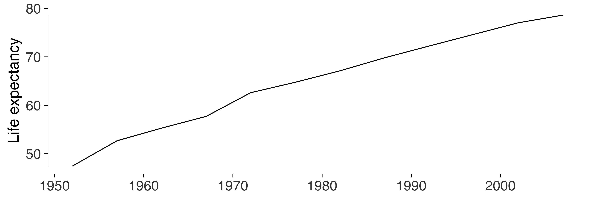
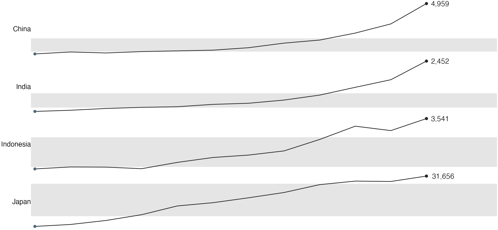
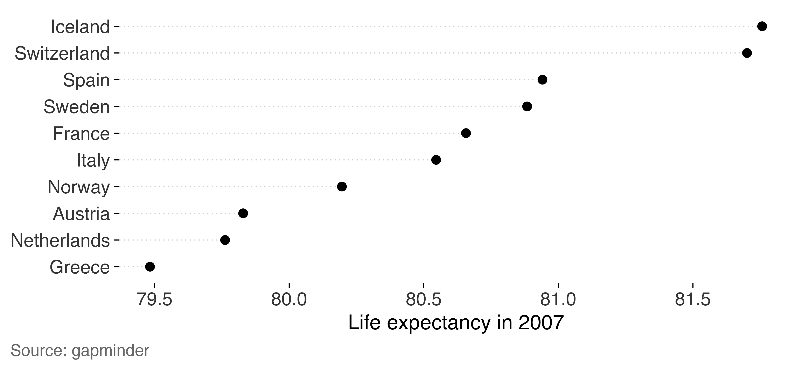

# Working through a real dataset

Two datasets, both public domain, both installed from CRAN rather than
downloaded while this page builds. `gapminder` gives life expectancy,
income and population for 142 countries every five years from 1952 to
2007. `palmerpenguins` gives body measurements for 344 penguins on three
islands in the Palmer Archipelago.

I’ve used real data here because the awkwardness is the point. Simulated
data is symmetric and well behaved, and most of what these measurements
have to say only shows up when the data isn’t.

``` r
library(gapminder)
library(palmerpenguins)
#> 
#> Attaching package: 'palmerpenguins'
#> The following objects are masked from 'package:datasets':
#> 
#>     penguins, penguins_raw

gap <- as.data.frame(gapminder)
peng <- as.data.frame(penguins[complete.cases(penguins), ])

dim(gap)
#> [1] 1704    6
dim(peng)
#> [1] 333   8
```

## Start with what ggplot2 gives you

``` r
default <- ggplot(peng, aes(flipper_length_mm, body_mass_g)) +
  geom_point(alpha = 0.6, size = 1.2)

default
```



``` r
r_default <- data_ink_ratio(default)
r_default
#> 
#> ── Data-ink ratio
#> 21% of the ink in this figure varies with the data.
#> • data ink: 9822 pixel-equivalents
#> • non-data ink: 36555
#> • measured at 6.5in x 4in, 150 dpi
```

The grey panel and the white grid account for most of that, and none of
it changes when a penguin does.

## Erase, then replace the frame

[`theme_tufte()`](https://lobsterbush.github.io/tufter/reference/theme_tufte.md)
takes off the background, the grid and the border.
[`geom_rangeframe()`](https://lobsterbush.github.io/tufter/reference/geom_rangeframe.md)
puts back something the border never gave you: an axis line that spans
only the range the data occupy, so the frame reports the minimum and
maximum for free.

``` r
lean <- default +
  geom_rangeframe() +
  labs(x = "Flipper length (mm)", y = "Body mass (g)") +
  theme_tufte() +
  label_source("Horst, Hill and Gorman, palmerpenguins")

lean
```



``` r
r_lean <- data_ink_ratio(lean)
r_lean
#> 
#> ── Data-ink ratio
#> 71% of the ink in this figure varies with the data.
#> • data ink: 11976 pixel-equivalents
#> • non-data ink: 4854
#> • measured at 6.5in x 4in, 150 dpi
```

3.4 times the share of the ink now varies with the data, on the same 333
penguins.

## A quartile frame, and where it stops working

[`geom_quartileframe()`](https://lobsterbush.github.io/tufter/reference/geom_rangeframe.md)
breaks the axis at the five-number summary, so the frame carries the
distribution rather than boxing the panel.
[`quartile_breaks()`](https://lobsterbush.github.io/tufter/reference/quartile_breaks.md)
puts the printed labels in the same places.

``` r
ggplot(peng, aes(flipper_length_mm, body_mass_g)) +
  geom_point(alpha = 0.6, size = 1.2) +
  geom_quartileframe() +
  scale_x_continuous(breaks = quartile_breaks(peng$flipper_length_mm)) +
  scale_y_continuous(breaks = quartile_breaks(peng$body_mass_g)) +
  labs(x = "Flipper length (mm)", y = "Body mass (g)") +
  theme_tufte()
```



Both variables here are close to symmetric, which is why all five marks
sit comfortably apart. On a skewed variable they crowd at one end. That
crowding is information, since it tells you the distribution is skewed,
and it also makes for an axis nobody can read, so on skewed data I’d use
a plain range frame and let the marks show the skew.

## Distributions: the box plot with the box erased

``` r
ggplot(peng, aes(species, body_mass_g)) +
  geom_tufteboxplot() +
  geom_rangeframe(sides = "l") +
  labs(x = NULL, y = "Body mass (g)") +
  theme_tufte() +
  label_source("palmerpenguins")
```



Gentoo penguins are heavier than the other two by about a kilogram, and
the two lighter species overlap almost completely. The box plot with the
box erased says that in a line and three dots.

## Slopegraphs: a before and after that a bar chart would bury

Life expectancy in South-East Asia, 1952 against 2007. Every number is
printed on the graphic, which makes the y axis redundant, so it goes.

``` r
picked <- c("Cambodia", "Indonesia", "Malaysia", "Philippines",
            "Thailand", "Vietnam", "Myanmar")
sea <- subset(gap, country %in% picked & year %in% c(1952, 2007))
sea$year <- factor(sea$year)

slopegraph(sea, year, lifeExp, country, accuracy = 0.1) +
  labs(title = "Life expectancy at birth, 1952 and 2007") +
  label_source("gapminder", note = "Years, South-East Asia.")
```



Every country rose, and the crossings are the interesting part. Thailand
began the highest of the seven and ends fifth. Vietnam began fourth and
ends joint top with Malaysia. Cambodia began third from the bottom and
ends last. A pair of bar charts would have shown exactly the same
fourteen numbers and hidden every one of those reorderings, which is the
case for the form.

## Small multiples

[`facet_tufte()`](https://lobsterbush.github.io/tufter/reference/facet_tufte.md)
fixes the scales, and warns if you try to free them, because free scales
destroy the comparison the design exists to make.

``` r
recent <- subset(gap, year >= 1977 & continent != "Oceania")

ggplot(recent, aes(gdpPercap, lifeExp)) +
  geom_point(alpha = 0.25, size = 0.7) +
  geom_rangeframe() +
  facet_tufte(~ continent, ncol = 4) +
  scale_x_log10(labels = scales::label_comma()) +
  labs(x = "GDP per capita (log scale)", y = "Life expectancy") +
  theme_tufte() +
  label_source("gapminder", note = "1977 onward.")
```



## Banking: how tall should the panel be?

One country’s life expectancy over 55 years. How steep the rise looks
depends on how tall the panel is, and
[`bank_to_45()`](https://lobsterbush.github.io/tufter/reference/bank_to_45.md)
picks the height that puts the median slope nearest 45 degrees, where
Cleveland found we judge slope most accurately.

``` r
korea <- subset(gap, country == "Korea, Rep.")

series <- ggplot(korea, aes(year, lifeExp)) +
  geom_line(linewidth = 0.35) +
  geom_rangeframe(sides = "l") +
  labs(x = NULL, y = "Life expectancy") +
  theme_tufte()

bank_to_45(series, width = 6.5)
#> 
#> ── Banking to 45 degrees
#> Aspect ratio 1.169 (height / width), from 11 segments by "median_slope".
#> At 6.5in wide, that's a panel 7.6in tall. Allow more for axis labels and
#> titles.
```

That height is for the panel. A saved figure needs more, for the axis
labels and the y title, and
[`check_labels_fit()`](https://lobsterbush.github.io/tufter/reference/check_labels_fit.md)
will tell you when you haven’t left enough.

``` r
series
```



## Sparklines, when each series has its own scale

``` r
four <- subset(gap, country %in% c("China", "India", "Japan", "Indonesia"))

sparklines(four, year, gdpPercap, country, accuracy = 1)
```



Four series whose levels differ by an order of magnitude. On shared axes
three of them would flatten against the bottom; each on its own scale,
the shapes are comparable even though the levels aren’t. That’s the
opposite choice from the small multiples above, and both are honest.

## Dot plots, when zero is a long way away

``` r
top <- subset(gap, year == 2007 & continent == "Europe")
top <- head(top[order(-top$lifeExp), ], 10)

ggplot(top, aes(lifeExp, stats::reorder(country, lifeExp))) +
  geom_cleveland_dot() +
  labs(x = "Life expectancy in 2007", y = NULL) +
  theme_tufte() +
  label_source("gapminder")
```



These ten countries sit between 79.5 and 81.8 years. Bars from zero
would put every one at nearly the same length and waste four fifths of
the panel. Bars cropped to the data would make a two-year spread look
like the whole story, and
[`lie_factor()`](https://lobsterbush.github.io/tufter/reference/lie_factor.md)
puts a number on how much.

``` r
bars <- ggplot(top, aes(stats::reorder(country, lifeExp), lifeExp)) + geom_col()

c(from_zero = lie_factor(bars),
  cropped   = lie_factor(bars + coord_cartesian(ylim = c(79, 82))))
#> from_zero   cropped 
#>    1.0000  125.5656
```

A dot encodes its value by position, so it can be read against a scale
that excludes zero without claiming anything about proportions. That’s
the whole reason to reach for one.

## Auditing the result

``` r
tufte_audit(lean, width = 6.5, height = 4)
#> 
#> ── Tufte audit ──
#> 
#> At 6.5in x 4in: 0 stated criteria not met.
#> 
#> ── Measured, not graded
#> Tufte states a direction for these rather than a threshold. Read them against
#> another draft of the same figure.
#> • Data-ink ratio 0.71: 71% of the ink varies with the data. Tufte asks that
#>   this be maximised within reason and names no threshold, so read it against
#>   another draft of this figure rather than against a target.
#> • Data density 36.3 numbers per square inch: 666 entries over 18.3 square
#>   inches. Tufte ranks published graphics by this and sets no minimum.
#> • 1 distinct colour in use. Tufte's advice on colour is qualitative, so this is
#>   a count and not a verdict.
#> • 1 series overlaid in one panel. facet_tufte() would show the same data as
#>   small multiples. Tufte gives no number at which to switch.
#> 
#> ── Met
#> • Panel carries no background fill
#> • No minor gridlines
#> • No full panel border
#> • No pie chart
#> • Lie factor within Tufte's band
#> • No legend to decode
#> • No variable encoded twice
#> • The figure names its source
#> • Wider than it is tall
#> • Ink clears the WCAG contrast minimum
#> • Nothing is clipped at the printed size
```

## A whole paper at once

``` r
figures <- list(
  `fig 1 penguins` = lean,
  `fig 2 species`  = ggplot(peng, aes(species, body_mass_g)) +
    geom_tufteboxplot() + geom_rangeframe(sides = "l") +
    theme_tufte() + label_source("palmerpenguins"),
  `fig 3 cropped`  = bars + coord_cartesian(ylim = c(79, 81))
)

audit_figures(figures, measure = FALSE)
#> 
#> ── Tufte audit: 3 figures ──
#> 
#> ── Stated criteria not met, most first
#> fig 3 cropped (5 not met)
#> Panel carries no background fill, No minor gridlines, Bars measured from zero,
#> Lie factor within Tufte's band, The figure names its source
#> 
#> ── Meeting every stated criterion
#> • fig 1 penguins
#> • fig 2 species
#> 
#> ℹ Full detail for any one figure: `attr(x, "audits")[["<name>"]]`
```

The cropped bar chart comes first because it fails the most stated
criteria, and the count is comparable across the three because every
figure is counted against the same list.
