# Examples with simulated data

Here are examples using simulated data. I’ve used settings familiar from
survey experiments and discrimination research, including callback rates
and treatment effects across conditions. The numbers are illustrative.

Run the setup and simulation helper before the examples. Each section
sets its seed so you can reproduce the figures.

## Simulating the data

This helper creates respondents, randomly assigns a condition, and
generates an outcome with a modest treatment effect.

``` r
simulate_experiment <- function(n = 900,
                                conditions = c("Control", "Information",
                                               "Norms", "Both"),
                                effects = c(0, 0.28, 0.19, 0.41),
                                seed = 20260729) {
  set.seed(seed)
  condition <- factor(sample(conditions, n, replace = TRUE),
                      levels = conditions)
  age <- round(rnorm(n, 46, 15))
  age <- pmin(pmax(age, 18), 85)
  effect <- effects[match(condition, conditions)]

  data.frame(
    id = seq_len(n),
    condition = condition,
    age = age,
    # Outcome on a 1 to 7 scale, with a mild age gradient.
    support = pmin(pmax(
      rnorm(n, 4.1 + effect + 0.012 * (age - 46), 1.15), 1
    ), 7)
  )
}

experiment <- simulate_experiment()
str(experiment)
#> 'data.frame':    900 obs. of  4 variables:
#>  $ id       : int  1 2 3 4 5 6 7 8 9 10 ...
#>  $ condition: Factor w/ 4 levels "Control","Information",..: 1 1 3 3 2 4 2 3 3 4 ...
#>  $ age      : num  43 43 20 51 61 39 35 64 59 29 ...
#>  $ support  : num  3.6 4.55 2.61 1.92 3.37 ...
```

## Distributions: the box plot with the box erased

[`geom_tufteboxplot()`](https://lobsterbush.github.io/tufter/reference/geom_tufteboxplot.md)
shows the distribution with whisker lines and a median mark.
`geom_rangeframe(sides = "l")` adds a vertical axis line spanning the
data.

``` r
ggplot(experiment, aes(condition, support)) +
  geom_tufteboxplot() +
  geom_rangeframe(sides = "l") +
  labs(
    x = NULL, y = "Support (1-7)",
    title = "Support for the policy, by experimental condition"
  ) +
  theme_tufte() +
  label_source("Simulated data, n = 900")
```

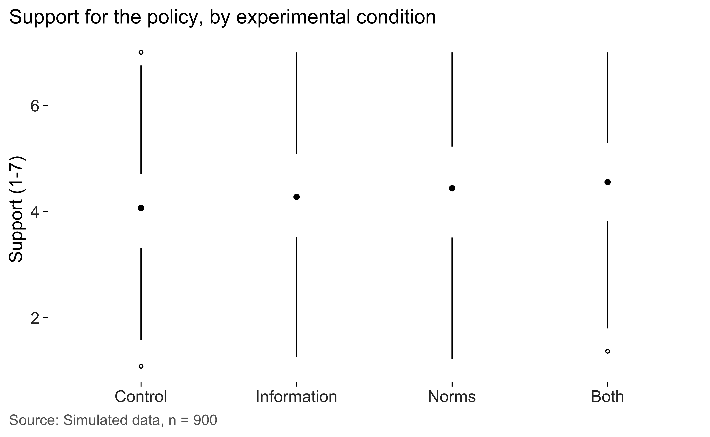

The default, `"point"`, leaves a gap for the interquartile range and
places a dot at the median. `"line"` uses a thicker interquartile
segment. `"offset"` places that segment beside the whiskers. I’d compare
them at the size the figure will be printed.

``` r
for (variant in c("line", "offset")) {
  print(
    ggplot(experiment, aes(condition, support)) +
      geom_tufteboxplot(type = variant) +
      geom_rangeframe(sides = "l") +
      labs(x = NULL, y = "Support", title = paste0('type = "', variant, '"')) +
      theme_tufte()
  )
}
```

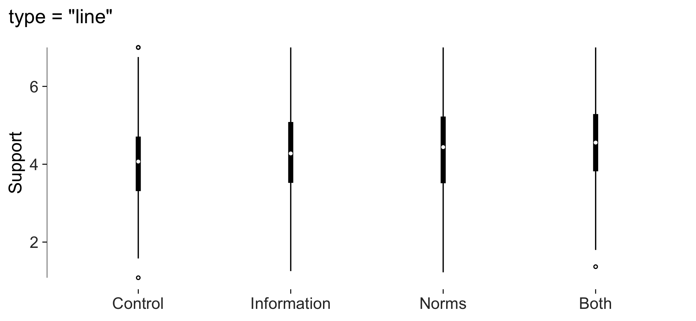

## Range frames and quartile frames

A range frame spans the observed values. A quartile frame also marks the
five-number summary, with labels supplied by
[`quartile_breaks()`](https://lobsterbush.github.io/tufter/reference/quartile_breaks.md).

All five breaks are kept by default. If labels crowd together, use
`min_gap` to omit some of them. Run
[`check_labels_fit()`](https://lobsterbush.github.io/tufter/reference/check_labels_fit.md)
and inspect the saved figure.

``` r
ggplot(experiment, aes(age, support)) +
  geom_point(alpha = 0.25, size = 1) +
  geom_quartileframe() +
  scale_x_continuous(breaks = quartile_breaks(experiment$age)) +
  scale_y_continuous(breaks = quartile_breaks(experiment$support)) +
  labs(x = "Age", y = "Support") +
  theme_tufte()
```

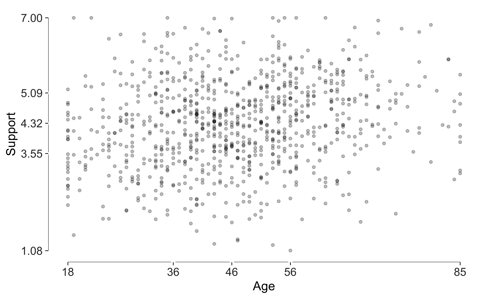

[`geom_dotdash()`](https://lobsterbush.github.io/tufter/reference/geom_dotdash.md)
adds a short tick for every observation along each margin. Turn off
ordinary theme ticks if you’d like these marks to replace them.

``` r
ggplot(experiment, aes(age, support)) +
  geom_point(alpha = 0.25, size = 1) +
  geom_dotdash() +
  labs(x = "Age", y = "Support") +
  theme_tufte(ticks = FALSE)
```

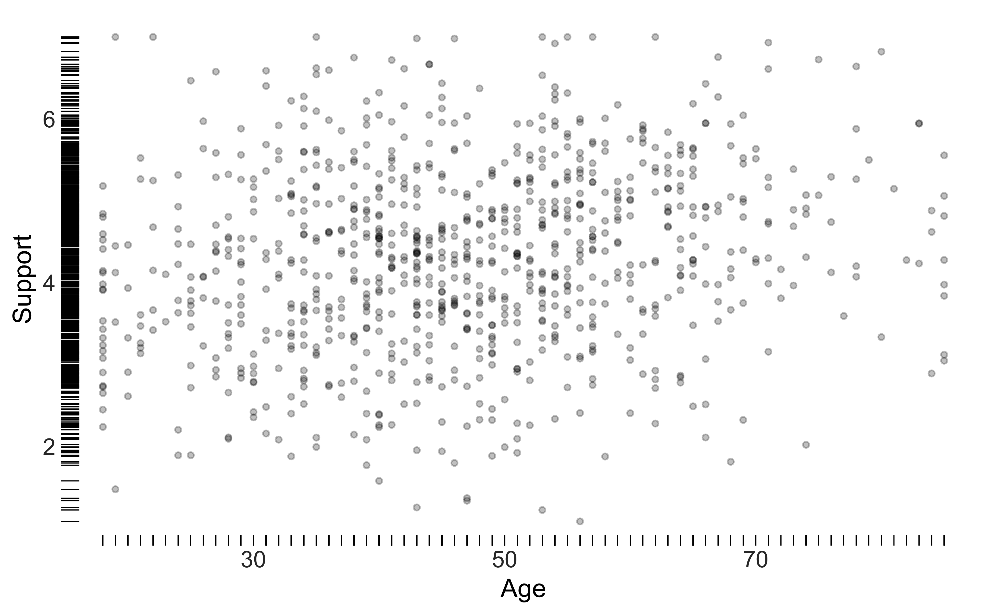

## Bars with the gridlines erased through them

This bar design uses gaps through the bars as gridlines. They help
readers estimate values without adding a separate grid across the panel.

The example shows simulated callback rates by applicant name and
occupation.

``` r
set.seed(11)
callbacks <- data.frame(
  name = rep(c("Emily", "Greg", "Lakisha", "Jamal"), each = 2),
  occupation = rep(c("Sales", "Administrative"), 4)
)
callbacks$rate <- round(
  c(10.8, 9.4, 10.2, 9.1, 6.6, 5.9, 6.4, 5.5) + rnorm(8, 0, 0.3), 1
)

ggplot(callbacks, aes(name, rate)) +
  geom_col_tufte(fill = "grey72") +
  facet_tufte(~ occupation) +
  labs(x = NULL, y = "Callback rate (%)",
       title = "Simulated callback rates by name and occupation") +
  theme_tufte() +
  label_source("Simulated data; not real audit-study results")
```

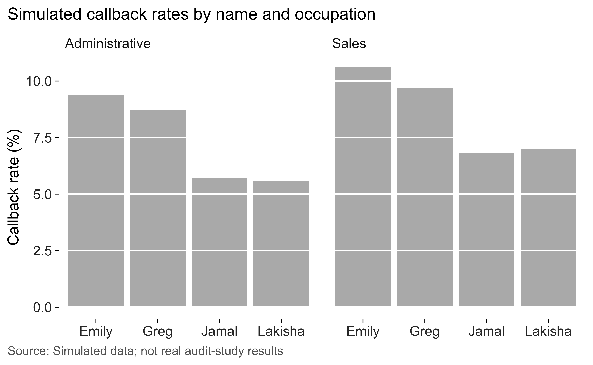

The bars start at zero.
[`tufte_audit()`](https://lobsterbush.github.io/tufter/reference/tufte_audit.md)
checks the baseline, and
[`lie_factor()`](https://lobsterbush.github.io/tufter/reference/lie_factor.md)
estimates distortion in supported bar comparisons.

## Dots, when a zero baseline isn’t wanted

A dot plot is useful when the values occupy a narrow range far from
zero. The dots show position on the scale. Leader lines help readers
follow each row to its value.

I’ve sorted the categories by value so rank is easy to see.

``` r
support <- aggregate(support ~ condition, experiment, mean)

ggplot(support, aes(support, stats::reorder(condition, support))) +
  geom_cleveland_dot() +
  labs(x = "Mean support (1-7)", y = NULL) +
  theme_tufte() +
  label_source("Simulated data, n = 900")
```

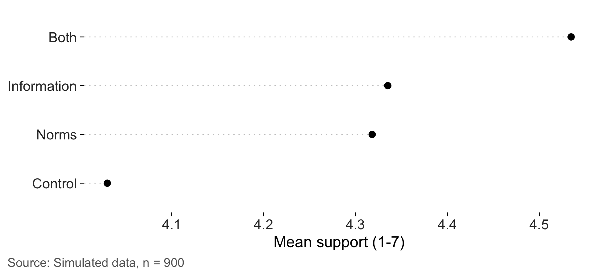

## Banking the aspect ratio

The same series looks steeper in a taller panel.
[`bank_to_45()`](https://lobsterbush.github.io/tufter/reference/bank_to_45.md)
uses Cleveland’s banking approach to suggest a height that brings the
median absolute slope near 45 degrees.

``` r
cycles <- data.frame(
  month = 1:240,
  value = sin(seq(0, 12 * pi, length.out = 240)) + seq(0, 2, length.out = 240)
)

series <- ggplot(cycles, aes(month, value)) +
  geom_line(linewidth = 0.3) +
  geom_rangeframe(sides = "l") +
  labs(x = "Month", y = "Index") +
  theme_tufte()

banked <- bank_to_45(series, width = 6.5)
banked
#> 
#> ── Banking to 45 degrees
#> Aspect ratio 0.133 (height / width), from 239 segments by "median_slope".
#> At 6.5in wide, that's a panel 0.86in tall. Allow more for axis labels and
#> titles.
```

At this height, I find the gradual upward trend easy to see. The
individual cycles are compressed.

``` r
series
```

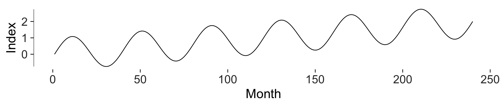

Here’s a taller version. It gives the cycles more space, which may be
useful if their pattern is what you want to compare.

``` r
series
```

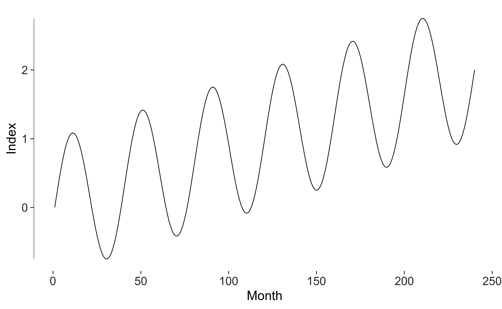

The choice depends on the question. I’d use the suggested height as a
starting point and compare it with another version.

## Is it dark enough to read?

[`check_contrast()`](https://lobsterbush.github.io/tufter/reference/check_contrast.md)
compares mark and text colours with the background. Its default minima
are 4.5 to 1 for text and 3 to 1 for marks. It doesn’t resolve every
overlapping mark or separately filled background.

``` r
check_contrast(
  ggplot(experiment, aes(age, support)) +
    geom_point(colour = "grey80", size = 0.8) +
    theme_tufte()
)
#> # A tibble: 3 × 5
#>   role       colour ratio threshold passes
#>   <chr>      <chr>  <dbl>     <dbl> <lgl> 
#> 1 data mark  grey80  1.61       3   FALSE 
#> 2 axis text  grey20 12.6        4.5 TRUE  
#> 3 axis title black  21          4.5 TRUE
```

Grey 80 has low contrast against white. I’d use a darker colour for
marks that readers need to distinguish individually.

## Small multiples

Repeating the same plot for each condition can make comparisons easier.
[`facet_tufte()`](https://lobsterbush.github.io/tufter/reference/facet_tufte.md)
fixes the scales and warns if you change them.

``` r
ggplot(experiment, aes(age, support)) +
  geom_point(alpha = 0.3, size = 0.8) +
  geom_smooth(method = "lm", se = FALSE, colour = "grey20", linewidth = 0.4,
              formula = y ~ x) +
  geom_rangeframe() +
  facet_tufte(~ condition, ncol = 4) +
  labs(x = "Age", y = "Support") +
  theme_tufte()
```

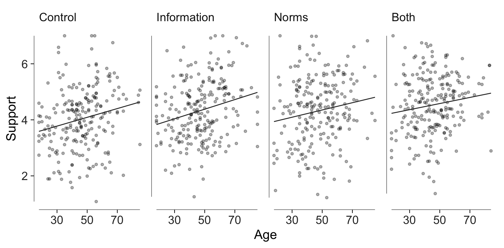

## Direct labelling instead of a legend

Put the series name at the end of the line with
[`geom_text_last()`](https://lobsterbush.github.io/tufter/reference/geom_text_last.md).
Readers can then identify a series where they’re looking at its values.

``` r
set.seed(4)
countries <- c("Australia", "Japan", "Korea", "New Zealand")
panel <- do.call(rbind, lapply(seq_along(countries), function(i) {
  data.frame(
    year = 2000:2024,
    country = countries[i],
    trust = cumsum(rnorm(25, 0.1 * (i - 2.5), 1.1)) + 45 + 4 * i
  )
}))

ggplot(panel, aes(year, trust, colour = country)) +
  geom_line(linewidth = 0.4) +
  # Labels take a fixed dark grey rather than the line colour: a label in the
  # lightest grey of a sequential palette is legible as a line and not as text.
  geom_text_last(aes(label = country, group = country), size = 3, colour = "grey15") +
  geom_rangeframe(sides = "l") +
  scale_x_continuous(expand = expansion(mult = c(0.02, 0.18))) +
  scale_colour_tufte("grey") +
  labs(x = NULL, y = "Institutional trust index") +
  theme_tufte() +
  theme(legend.position = "none") +
  label_source("Simulated panel, four countries, 2000-2024")
```

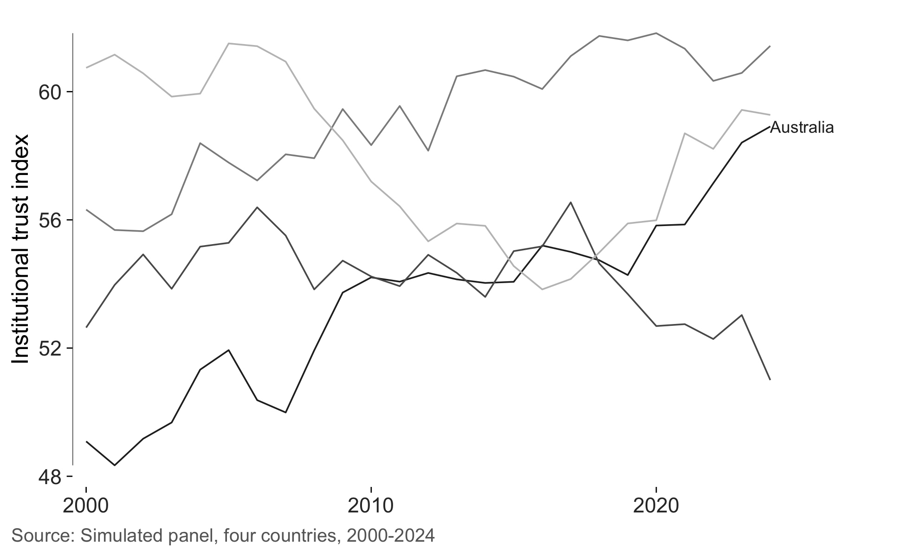

These labels can overlap because
[`geom_text_last()`](https://lobsterbush.github.io/tufter/reference/geom_text_last.md)
doesn’t move them apart. Try `nudge_y` or
[`ggrepel::geom_text_repel()`](https://ggrepel.slowkow.com/reference/geom_text_repel.html)
if the endpoints are close. The slopegraph function below includes label
spacing, though dense plots still need inspection.

## Slopegraphs

A slopegraph compares two periods. The labels give the values and line
crossings show changes in rank. I find it useful when both the levels
and the changes matter.

``` r
set.seed(7)
units <- c("Victoria", "New South Wales", "Queensland", "South Australia",
           "Western Australia", "Tasmania")
before <- round(runif(6, 22, 41), 1)
change <- round(rnorm(6, 3.5, 5), 1)

wave <- data.frame(
  state = rep(units, each = 2),
  wave = rep(c("2015", "2025"), 6),
  value = as.vector(rbind(before, before + change))
)

slopegraph(wave, wave, value, state) +
  scale_x_continuous(breaks = 1:2, labels = c("2015", "2025"),
                     position = "top", expand = expansion(mult = 0.5)) +
  labs(
    title = "Share reporting contact with a migrant neighbour",
    subtitle = "Simulated two-wave panel, percentage points"
  )
#> Scale for x is already present.
#> Adding another scale for x, which will replace the existing scale.
```

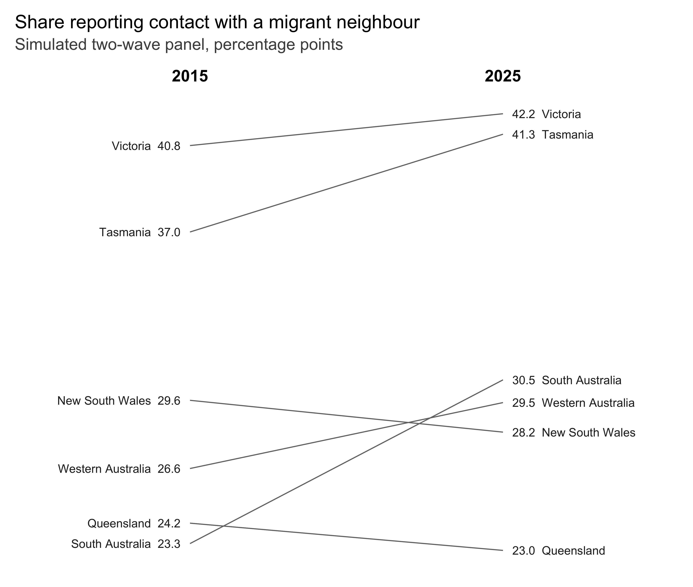

Set `direction_colour = TRUE` to distinguish increases from decreases by
colour. I’d use that when direction is the comparison I want to
emphasize.

``` r
slopegraph(wave, wave, value, state, direction_colour = TRUE) +
  scale_x_continuous(breaks = 1:2, labels = c("2015", "2025"),
                     position = "top", expand = expansion(mult = 0.5))
#> Scale for x is already present.
#> Adding another scale for x, which will replace the existing scale.
```

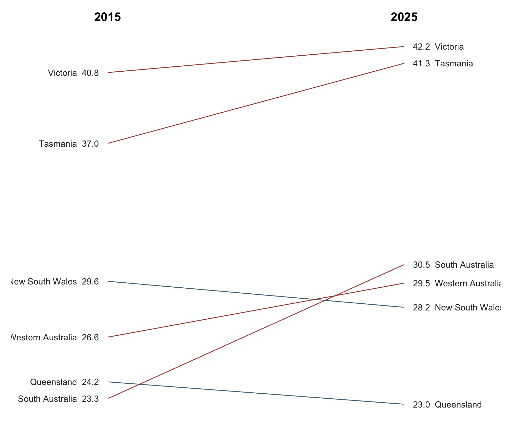

## Sparklines

Sparklines fit a series into a small space. Here the band shows its
interquartile range and the dots identify the extremes. Each series has
its own vertical scale, so compare patterns rather than heights across
rows.

``` r
set.seed(21)
indicators <- do.call(rbind, lapply(
  c("Turnout", "Trust in parliament", "Union density", "Newspaper readership"),
  function(nm) {
    data.frame(
      quarter = 1:80,
      series = nm,
      value = cumsum(rnorm(80, 0, 1)) + 50
    )
  }
))

sparklines(indicators, quarter, value, series)
```

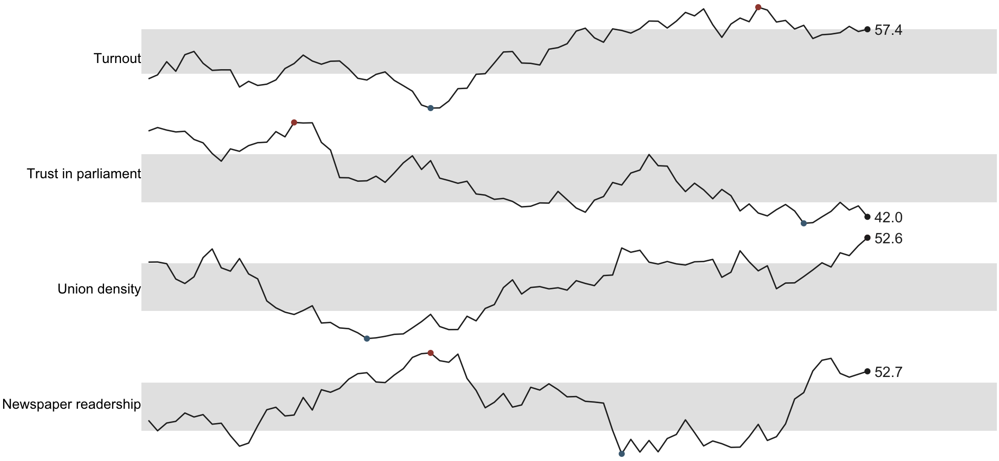

Use
[`sparkline()`](https://lobsterbush.github.io/tufter/reference/sparkline.md)
for one series.
[`sparkline_grob()`](https://lobsterbush.github.io/tufter/reference/sparkline_grob.md)
returns a grob you can place in a table or another graphic.

``` r
set.seed(3)
sparkline(cumsum(rnorm(60)) + 20)
```

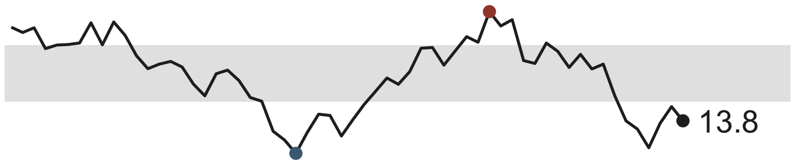

## Colour as a code

The palettes serve different uses. `"grey"` gives an ordered sequence.
`"accent"` adds one red series to a set of greys. `"muted"` uses earth
tones, and `"divergent"` provides a blue-to-red scale with a neutral
midpoint. Check their contrast in the figure where you’ll use them.

``` r
pals <- c("grey", "accent", "muted", "divergent")
swatches <- do.call(rbind, lapply(pals, function(p) {
  cols <- tufte_pal(p)(5)
  data.frame(palette = p, i = seq_along(cols), colour = cols)
}))

ggplot(swatches, aes(i, palette, fill = colour)) +
  geom_tile(colour = "white", linewidth = 2) +
  scale_fill_identity() +
  labs(x = NULL, y = NULL) +
  theme_tufte(ticks = FALSE) +
  theme(axis.text.x = element_blank())
```

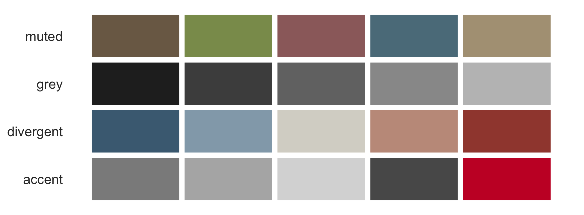

Here I’ve used grey for the comparison series and an accent for the one
I want readers to notice.

``` r
focus <- panel
focus$highlight <- ifelse(focus$country == "Korea", "Korea", "Other")

ggplot(focus, aes(year, trust, group = country, colour = highlight)) +
  geom_line(linewidth = 0.4) +
  geom_rangeframe(sides = "l") +
  scale_colour_manual(values = c(Korea = "#c8102e", Other = "#bfbfbf")) +
  geom_text_last(
    data = subset(focus, country == "Korea"),
    aes(label = country), size = 3, colour = "#c8102e"
  ) +
  scale_x_continuous(expand = expansion(mult = c(0.02, 0.1))) +
  labs(x = NULL, y = "Institutional trust index") +
  theme_tufte() +
  theme(legend.position = "none")
```

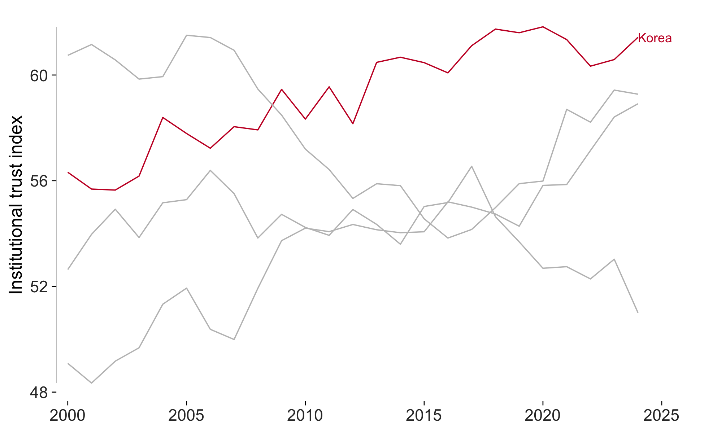

## Auditing the result

[`tufte_audit()`](https://lobsterbush.github.io/tufter/reference/tufte_audit.md)
checks the available criteria and reports measurements that you can
compare across drafts.

``` r
final <- ggplot(experiment, aes(condition, support)) +
  geom_tufteboxplot() +
  geom_rangeframe(sides = "l") +
  labs(x = NULL, y = "Support (1-7)") +
  theme_tufte() +
  label_source("Simulated data, n = 900")

tufte_audit(final, width = 6.5, height = 4)
#> 
#> ── Tufte audit ──
#> 
#> At 6.5in x 4in: 0 stated criteria not met.
#> 
#> ── Measured, not graded
#> Tufte states a direction for these rather than a threshold. Read them against
#> another draft of the same figure.
#> • Data-ink ratio 0.52: an estimated 52% of the ink comes from data layers.
#>   Compare drafts at the same dimensions; there's no target value.
#> • Data density 88.3 entries per square inch: 1800 estimated entries over 20.4
#>   square inches. Read this alongside the figure and entry count.
#> • 1 distinct colour in use. This is a count, not a verdict on whether the
#>   colours help readers.
#> • One series in one panel. There's no series grouping to separate into small
#>   multiples.
#> 
#> ── Met
#> • Panel carries no background fill
#> • No minor gridlines
#> • No full panel border
#> • No pie chart
#> • Lie factor within Tufte's band
#> • No legend to decode
#> • No variable encoded twice
#> • The figure names its source
#> • Wider than it is tall
#> • Ink clears the WCAG contrast minimum
#> • Measured labels fit at the printed size
```

The [measuring
article](https://lobsterbush.github.io/tufter/articles/measuring.md)
explains how the estimates work and where they need careful
interpretation.
