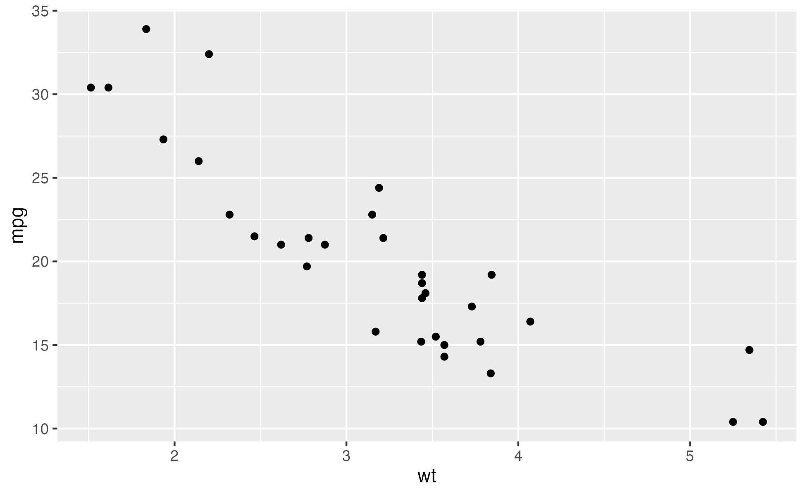
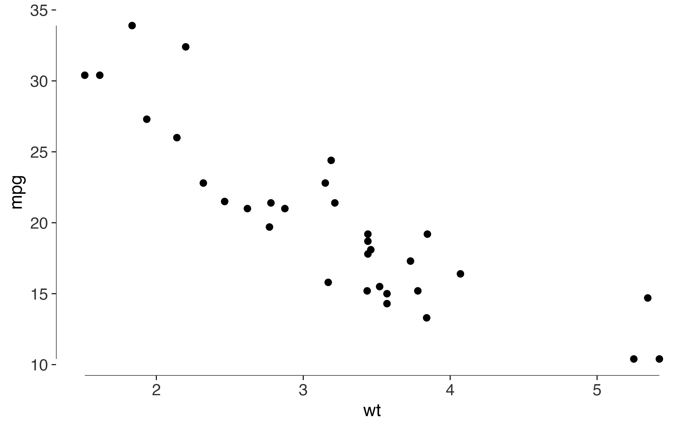
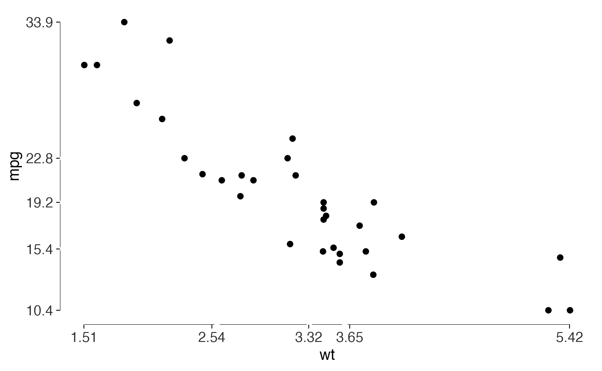
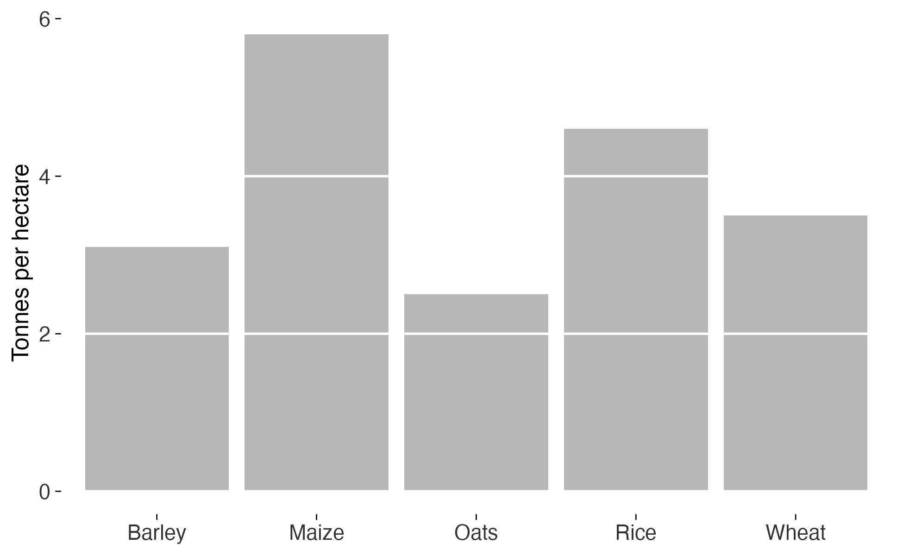
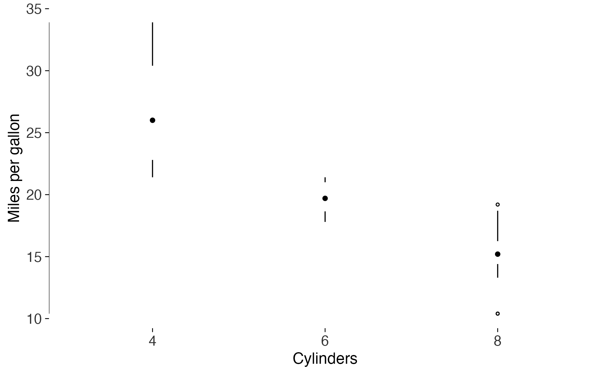
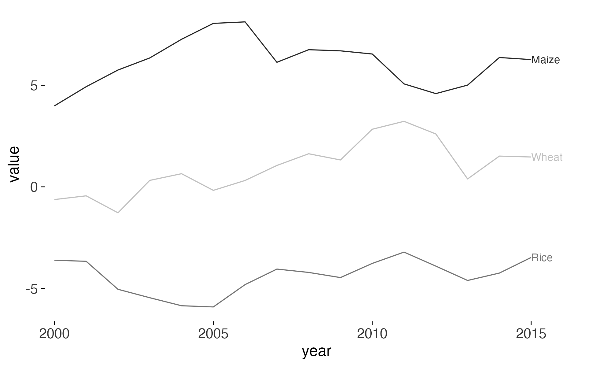
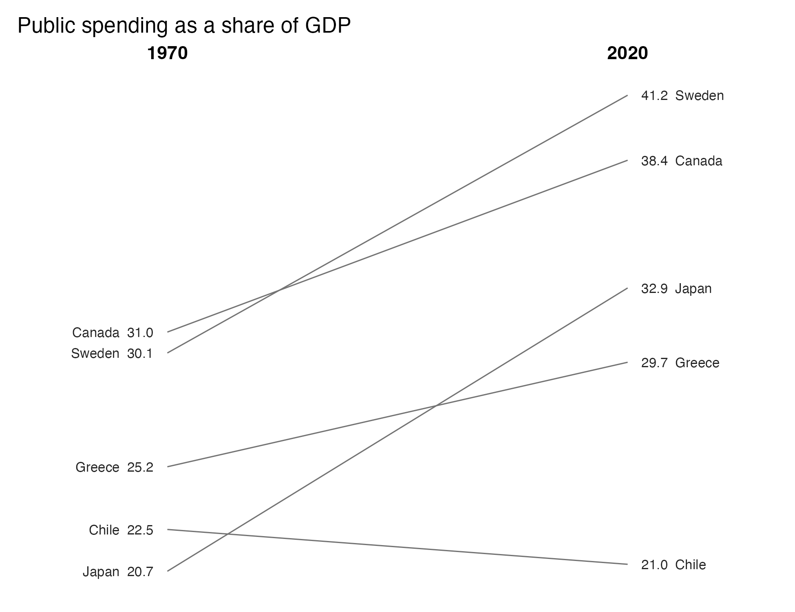
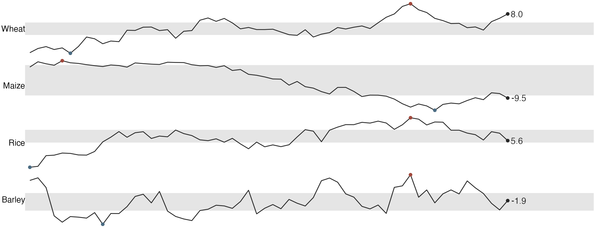
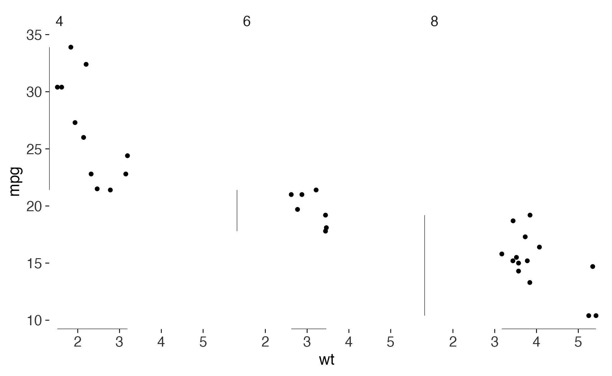

# Designing and measuring a figure

Tufte’s argument in *The Visual Display of Quantitative Information* is
that statistical graphics can be evaluated, not merely preferred. He
gives quantities: the data-ink ratio, the lie factor, data density. This
package takes that seriously in both directions. It supplies the
graphical forms he designed, and it supplies the measurements, so that a
figure you have drawn can be examined rather than admired.

It is careful about one distinction. Tufte states a criterion for some
principles, a graphic either meeting it or not, and only a direction for
others. The audit grades the first kind and measures the second, and
there is no score, because collapsing the two would mean inventing
thresholds and a weighting that are nowhere in his books.

## Start with a default plot

Here is a scatterplot as `ggplot2` draws it out of the box.

``` r
base <- ggplot(mtcars, aes(wt, mpg)) +
  geom_point()

base
```



Now measure it.

``` r
data_ink_ratio(base)
#> 
#> ── Data-ink ratio
#> 6% of the ink in this figure varies with the data.
#> • data ink: 2103 pixel-equivalents
#> • non-data ink: 35623
#> • measured at 6.5in x 4in, 150 dpi
```

Almost none of that ink is doing any work. The grey panel, the white
grid, the minor gridlines and the axis furniture account for nearly all
of it, and none of them change when the data change.

## Erase, then replace the frame

[`theme_tufte()`](https://lobsterbush.github.io/tufter/reference/theme_tufte.md)
removes the background, the grid and the border.
[`geom_rangeframe()`](https://lobsterbush.github.io/tufter/reference/geom_rangeframe.md)
puts something better in place of the border: an axis line drawn only
across the range the data occupy, so the frame reports the minimum and
maximum for free.

``` r
lean <- base +
  geom_rangeframe() +
  theme_tufte()

lean
```



``` r
data_ink_ratio(lean)
#> 
#> ── Data-ink ratio
#> 74% of the ink in this figure varies with the data.
#> • data ink: 3549 pixel-equivalents
#> • non-data ink: 1245
#> • measured at 6.5in x 4in, 150 dpi
```

[`geom_quartileframe()`](https://lobsterbush.github.io/tufter/reference/geom_rangeframe.md)
goes further, breaking the axis at the quartiles so it carries the whole
five-number summary. Pair it with
[`quartile_breaks()`](https://lobsterbush.github.io/tufter/reference/quartile_breaks.md)
so the printed labels agree with the breaks.

``` r
base +
  geom_quartileframe() +
  scale_x_continuous(breaks = quartile_breaks(mtcars$wt)) +
  scale_y_continuous(breaks = quartile_breaks(mtcars$mpg)) +
  theme_tufte()
```



## The audit

[`tufte_audit()`](https://lobsterbush.github.io/tufter/reference/tufte_audit.md)
reports the stated criteria a figure does not meet, each named with the
principle and the chapter it comes from, and separately measures the
quantities Tufte gives a direction for.

``` r
tufte_audit(lean, width = 6.5, height = 4)
#> 
#> ── Tufte audit ──
#> 
#> At 6.5in x 4in: 1 stated criterion not met.
#> 
#> ── Not met
#> ✖ No caption. Tufte asks that evidence be thoroughly described and its sources
#>   indicated on the graphic itself, so the claim can be checked without hunting
#>   through the surrounding text. See label_source().
#> Documentation - Beautiful Evidence ch. 6
#> 
#> ── Measured, not graded
#> Tufte states a direction for these, not a threshold. Read them against another
#> draft of the same figure.
#> • Data-ink ratio 0.74: 74% of the ink varies with the data. Tufte asks that
#>   this be maximised within reason and names no threshold, so read it against
#>   another draft of this figure rather than against a target.
#> • Data density 3.2 numbers per square inch: 64 entries over 20.1 square inches.
#>   Tufte ranks published graphics by this and sets no minimum.
#> • 1 distinct colour in use. Tufte's advice on colour is qualitative, so this is
#>   a count and not a verdict.
#> • 1 series overlaid in one panel. facet_tufte() would show the same data as
#>   small multiples; Tufte gives no number at which to switch.
#> 
#> ── Met
#> • Panel carries no background fill
#> • No minor gridlines
#> • No full panel border
#> • No pie chart
#> • Lie factor within Tufte's band
#> • No legend to decode
#> • No variable encoded twice
#> • Wider than it is tall
#> • Ink clears the WCAG contrast minimum
#> • Nothing is clipped at the printed size
```

The remaining failure is the one no theme can fix for you: the figure
does not say where its numbers came from.
[`label_source()`](https://lobsterbush.github.io/tufter/reference/label_source.md)
handles that.

``` r
tufte_audit(lean + label_source("Motor Trend, 1974"), width = 6.5, height = 4)
#> 
#> ── Tufte audit ──
#> 
#> At 6.5in x 4in: 0 stated criteria not met.
#> 
#> ── Measured, not graded
#> Tufte states a direction for these, not a threshold. Read them against another
#> draft of the same figure.
#> • Data-ink ratio 0.66: 66% of the ink varies with the data. Tufte asks that
#>   this be maximised within reason and names no threshold, so read it against
#>   another draft of this figure rather than against a target.
#> • Data density 3.4 numbers per square inch: 64 entries over 18.9 square inches.
#>   Tufte ranks published graphics by this and sets no minimum.
#> • 1 distinct colour in use. Tufte's advice on colour is qualitative, so this is
#>   a count and not a verdict.
#> • 1 series overlaid in one panel. facet_tufte() would show the same data as
#>   small multiples; Tufte gives no number at which to switch.
#> 
#> ── Met
#> • Panel carries no background fill
#> • No minor gridlines
#> • No full panel border
#> • No pie chart
#> • Lie factor within Tufte's band
#> • No legend to decode
#> • No variable encoded twice
#> • The figure names its source
#> • Wider than it is tall
#> • Ink clears the WCAG contrast minimum
#> • Nothing is clipped at the printed size
```

Notice what the audit does not do: it never grades the data-ink ratio or
the data density. Tufte asks that both be pushed in a direction and
names no threshold for either, so the audit reports them and leaves the
judgement with you. Read them against another draft of the same figure.

Meeting every stated criterion does not make a figure good. Tufte’s
first principle is that content counts most of all, and no function
evaluates that. What the audit is good for is the mechanical failures
that authors stop seeing after the fifth draft.

## Graphical integrity

The most common way a real figure lies is a bar chart whose baseline is
not zero: bar length stops being proportional to the quantity it stands
for.
[`lie_factor()`](https://lobsterbush.github.io/tufter/reference/lie_factor.md)
measures the distortion.

``` r
d <- data.frame(president = c("Bush", "Obama"), growth = c(100, 110))

honest <- ggplot(d, aes(president, growth)) + geom_col()
truncated <- honest + coord_cartesian(ylim = c(95, 115))

lie_factor(honest)
#> [1] 1
lie_factor(truncated)
#> [1] 16.66667
```

A ten percent difference drawn as a sixteen-fold one. Tufte treats
anything outside roughly 0.95 to 1.05 as distortion.

Given the numbers directly,
[`lie_factor()`](https://lobsterbush.github.io/tufter/reference/lie_factor.md)
reproduces his own examples. The fuel-economy graphic in *The Visual
Display* showed an eighteen percent change as a line growing by seven
hundred and eighty-three percent.

``` r
lie_factor(c(18.0, 27.5), c(0.6, 5.3))
#> [1] 14.84211
```

## Bars with the gridlines erased

Bar charts need gridlines, because readers have to recover values from
bar heights. But a gridline crossing a bar is drawn on top of ink that
already encodes the same value. Tufte’s redesign erases it there
instead.

``` r
d <- data.frame(
  crop = c("Wheat", "Maize", "Rice", "Barley", "Oats"),
  yield = c(3.5, 5.8, 4.6, 3.1, 2.5)
)

ggplot(d, aes(crop, yield)) +
  geom_col_tufte(fill = "grey72") +
  labs(x = NULL, y = "Tonnes per hectare") +
  theme_tufte()
```



## Box plots without the box

The box in a box plot is a container for four numbers that a line and a
dot can hold on their own.

``` r
ggplot(mtcars, aes(factor(cyl), mpg)) +
  geom_tufteboxplot() +
  geom_rangeframe(sides = "l") +
  labs(x = "Cylinders", y = "Miles per gallon") +
  theme_tufte()
```



`type = "line"` and `type = "offset"` keep progressively more, for when
the whiskers are short and the interquartile range needs its own mark.

## Labels on the data, not in a legend

A legend makes the reader look away, hold a colour in memory, look back,
and match.
[`geom_text_last()`](https://lobsterbush.github.io/tufter/reference/geom_text_last.md)
puts the name where the eye already is.

``` r
series <- data.frame(
  year = rep(2000:2015, 3),
  value = c(cumsum(rnorm(16)), cumsum(rnorm(16)) + 4, cumsum(rnorm(16)) - 4),
  crop = rep(c("Wheat", "Maize", "Rice"), each = 16)
)

ggplot(series, aes(year, value, colour = crop)) +
  geom_line(linewidth = 0.4) +
  geom_text_last(aes(label = crop), size = 3) +
  scale_x_continuous(expand = expansion(mult = c(0.02, 0.12))) +
  scale_colour_tufte("grey") +
  theme_tufte() +
  theme(legend.position = "none")
```



## Slopegraphs

A slopegraph shows before-and-after for many units at once. Every number
is printed on the graphic, which makes the y axis redundant, so it goes.
The table and the figure become the same object.

``` r
d <- data.frame(
  country = rep(c("Sweden", "Japan", "Chile", "Canada", "Greece"), each = 2),
  year = rep(c("1970", "2020"), 5),
  spending = c(30.1, 41.2, 20.7, 32.9, 22.5, 21.0, 31.0, 38.4, 25.2, 29.7)
)

slopegraph(d, year, spending, country) +
  labs(title = "Public spending as a share of GDP")
```



## Sparklines

A sparkline is word-sized: small enough to sit inside a sentence, with
the normal range as a grey band, dots at the extremes, and the final
value printed at the end.

``` r
d <- data.frame(
  month = rep(1:60, 4),
  value = c(cumsum(rnorm(60)), cumsum(rnorm(60)), cumsum(rnorm(60)),
            cumsum(rnorm(60))),
  series = rep(c("Wheat", "Maize", "Rice", "Barley"), each = 60)
)

sparklines(d, month, value, series)
```



## Small multiples

The answer to multivariate data is repetition rather than complication:
the same graphic, at the same scale, once per condition.
[`facet_tufte()`](https://lobsterbush.github.io/tufter/reference/facet_tufte.md)
fixes the scales, because free scales destroy the comparison the design
exists to make.

``` r
ggplot(mtcars, aes(wt, mpg)) +
  geom_point(size = 1) +
  geom_rangeframe() +
  facet_tufte(~ cyl) +
  theme_tufte()
```



## Before you save

A figure designed carefully and then saved at the wrong size is a figure
with a truncated subtitle. `ggplot2` does not wrap long text, it clips
it.
[`check_labels_fit()`](https://lobsterbush.github.io/tufter/reference/check_labels_fit.md)
renders at the size you intend to print and measures.

``` r
wordy <- lean +
  labs(subtitle = paste(rep("A subtitle that runs on rather too long", 4),
                        collapse = " "))

check_labels_fit(wordy, width = 6.5, height = 4)
#> Warning in check_labels_fit(wordy, width = 6.5, height = 4): 1 element will be clipped at 6.5in x 4in.
#> ✖ subtitle needs 10.18in but has 6.50in.
#> ℹ Hard-wrap the text, widen the canvas, or reduce the font size.
#> # A tibble: 7 × 4
#>   element                      required_in available_in fits 
#>   <chr>                              <dbl>        <dbl> <lgl>
#> 1 layout (non-panel width)           0.611         6.5  TRUE 
#> 2 layout (non-panel height)          0.818         4    TRUE 
#> 3 subtitle                          10.2           6.5  FALSE
#> 4 x axis title                       0.167         6.5  TRUE 
#> 5 y axis title                       0.125         6.5  TRUE 
#> 6 x axis labels (side by side)       0.333         5.89 TRUE 
#> 7 y axis labels (stacked)            0.667         3.18 TRUE
```

[`save_tufte()`](https://lobsterbush.github.io/tufter/reference/save_tufte.md)
runs that check before writing, so the warning arrives while you can
still act on it, and defaults to 6.5 inches wide with `cairo_pdf` for
PDF output.

``` r
save_tufte("figure-1.pdf", lean, width = 6.5, height = 4)
```

## What the package cannot do

[`tufte_principles()`](https://lobsterbush.github.io/tufter/reference/tufte_principles.md)
lists every principle, the book it comes from, and the function that
implements it. The `audited` column is the honest part: it marks which
principles a function can check and which it cannot.

``` r
p <- tufte_principles()
p[!p$audited, c("principle", "implemented_by")]
#> # A tibble: 9 × 2
#>   principle                  implemented_by                             
#>   <chr>                      <chr>                                      
#> 1 The dot-dash plot          geom_dotdash()                             
#> 2 Shrink the graphic         sparkline(), sparklines()                  
#> 3 Position beats length      geom_cleveland_dot()                       
#> 4 Micro and macro readings   sparklines(), facet_tufte()                
#> 5 Show comparisons           slopegraph(), facet_tufte()                
#> 6 Show causality             annotation, not code                       
#> 7 Show multivariate data     facet_tufte(), sparklines()                
#> 8 Sparklines                 sparkline(), sparklines(), sparkline_grob()
#> 9 Content counts most of all you
```

Showing causality, showing comparisons, and content counting most of all
are not things a package can verify. They are what the figure is for.
